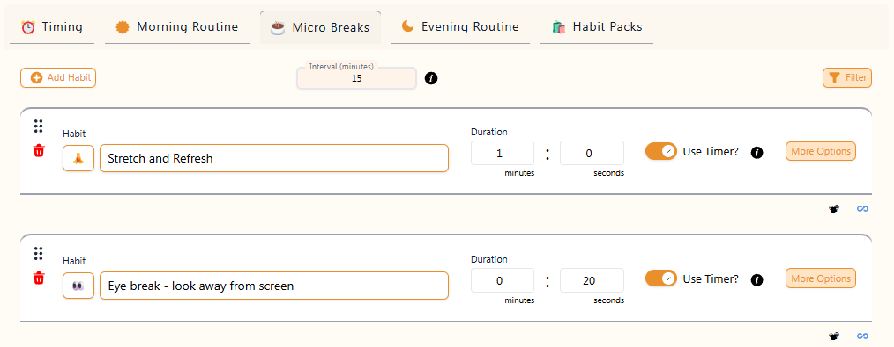

# 🏢 Occupational Health & Safety (OHS) for Desk-Based Work

## 🔍 Research & Learn

### Risks
- theres multiple different risks for using a laptop without a monitor or keyboard. Those are listed below:
- discomfort, fatigues and long term musculoskeletal damage from hunching down and looking at the screen at a weird angle. 
- neck and shoulder pains 
- back issues 
- wrist and hand injuries from funny hand placement
### Equipment
- Anything that would stop you from looking down at the screen and hunching your back will help preventing long term damages to the body.
- a seperate monitor with an external keyboard and mouse might force you to sit more comfortably. 
- an ergonomic chair that supports the back correctly or a standing desk will releif backstrains

### Adjustments
- best adjustments that could be made are placement of the monitor slightly below eye level, one arms length away. 
- chair and feet are flat on the ground, knees at 90 degrees, thighs positioned horizontally. 
- desk positioned so the elbows rest at around 90 degrees with wrists straight while typing and using the mouse. 

### Habits
- some habits will reduce the daily impact of long laptop use, those include eye strain reduction techniques, posture checks and activity breaks. 

## 📝 Reflection

### Equipment changes
- I use a PC and mostly have an ergonomically correct setup. however I could still improve by adjusting the hight of my desk to make it lower and regularly use the keyboard wrist rest to position them to the correct angle.
### Behavioral changes
- I need to take more regualr breaks to stretch and rest my eyes. As well as fix my posture every 15 to 20 mins. 
### Reminders
- Using focus bear for reminders would be helpful for my health. Some things I can remind myself doing would be: getting up every 20 mins for a stretch, closing my eyes and adjusting my posture. 

## Documentation
Added two habits, eye stretch and gentle stretch through foucs bear, adjusted desk height. 

