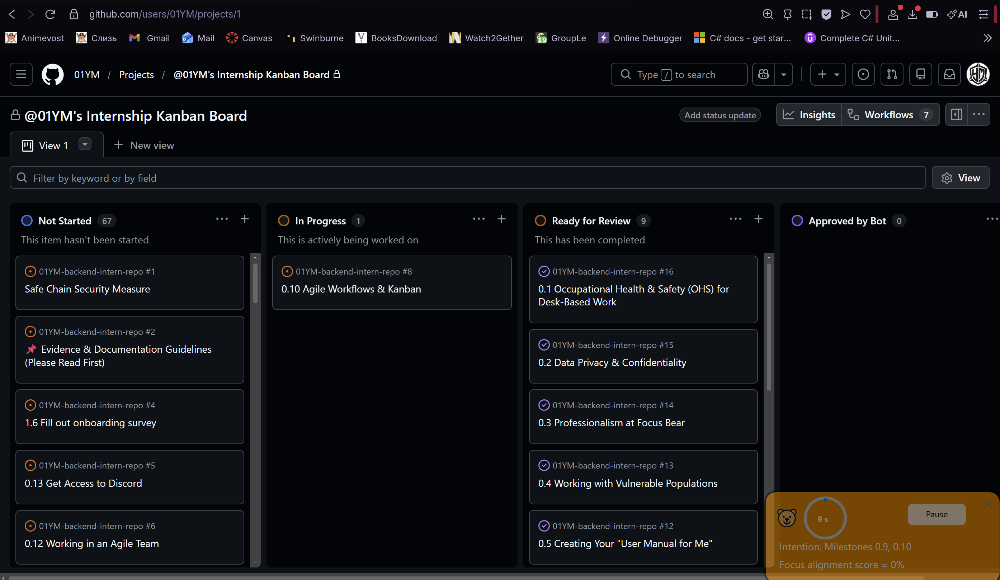

## Reflection

### How does Kanban help manage priorities and avoid overload

- It helps to manage priorities by making all tasks visible and showing what needs attention. By limiting the number of tasks in progress, it prevents taking on too much work at once and instead focusing at one task at a time.

### How can you improve your workflow using Kanban principles?

- breaking tasks into smaller ones. 
- updating task status regularly
- focusing on comlpeting tasks before starting new ones
- identifying blockers early on and communicating them 

## Task 

### Identify one way you can improve task tracking in your role

- Updating the Kanban consistently. This would keep the team informed of my progress and make it easy to identify any blockers I face.
