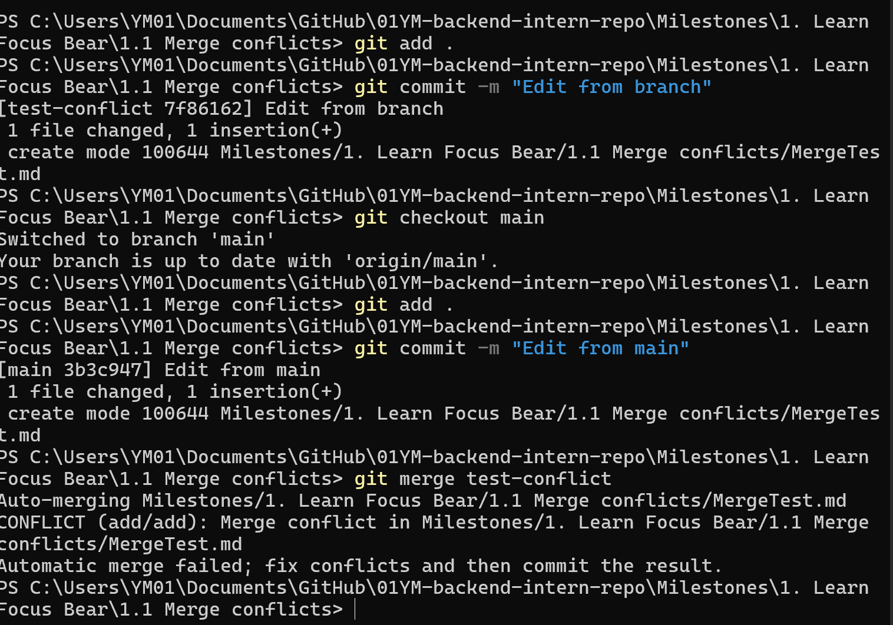
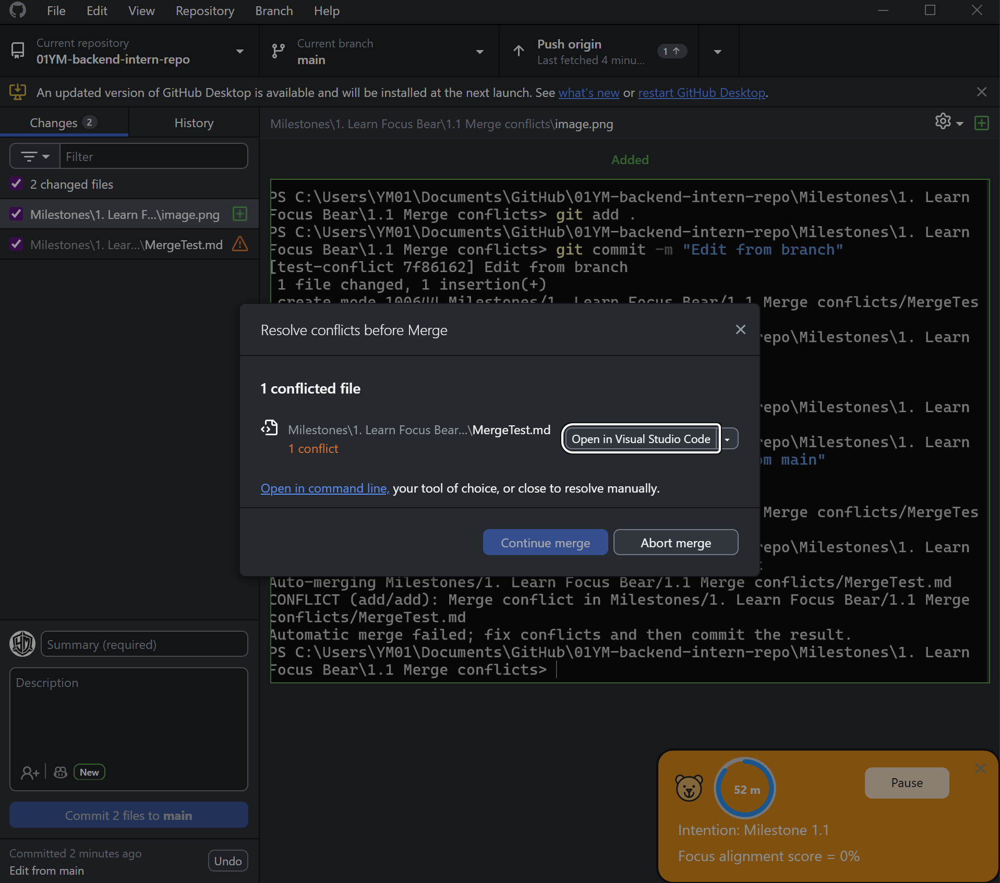
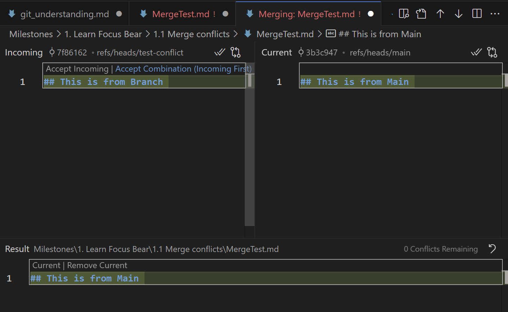
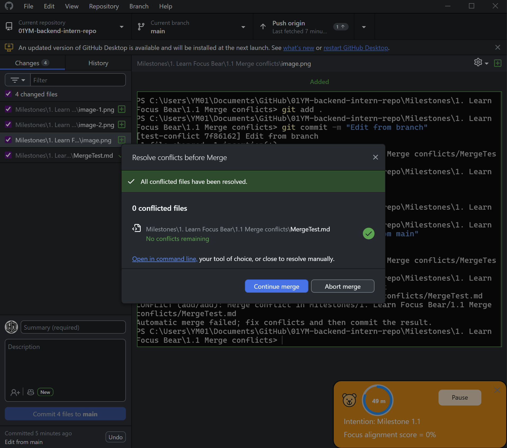

# Git Understanding: Merge Conflicts

## What caused the conflict?

The conflict happened for editing the same file (`MergeTest.md`) in two different branches  
- In the branch: `## This is from Branch`  
- In main: `## This is from Main`  

When merging, Git couldn’t decide which version to keep.

---

## Steps I followed

### 1. Created conflict in terminal

I created a branch, edited the file, then edited the same file differently in `main` and merged 

---

### 2. Conflict shown in GitHub Desktop

GitHub Desktop detected the conflict

---

### 3. Resolved in VS Code

I opened the file and chose which version to keep, I could also keep both lines or work my way around the changes. Depending on the issue, there could be multiple solutions.

---

### 4. Completed merge

After resolving, I continued the merge in GitHub Desktop.

---

## How I resolved it

I reviewed both versions in VS Code and kept the correct one, then marked the conflict as resolved and completed the merge.

---

## What I learned

- Merge conflicts happen when the same file is changed in different ways  
- Git cannot resolve these automatically  
- Tools like VS Code make resolving conflicts easier  
- It’s important to communicate and pull changes often to avoid conflicts  