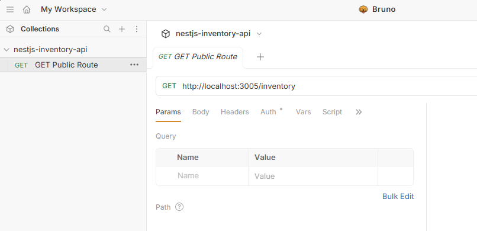
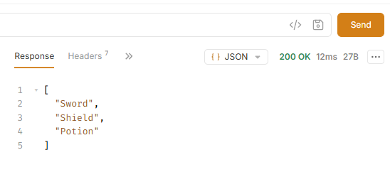
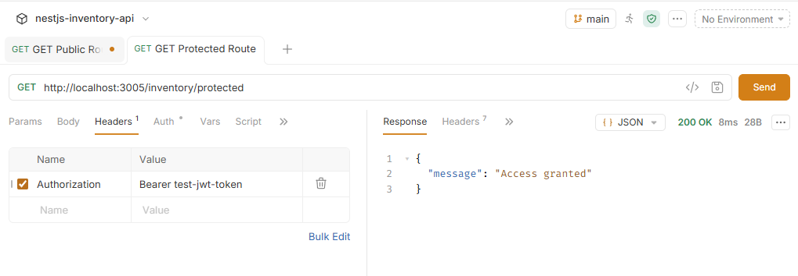
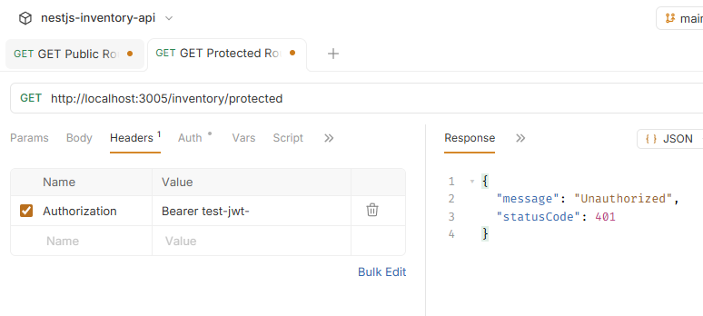
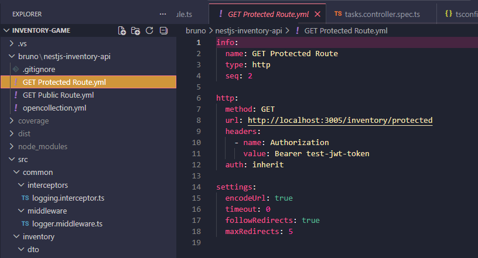

### Reflection for nestjs-bruno.md

### How does Bruno help with API testing compared to Postman or cURL?

- Bruno helps because it gives me a simple visual way to test API endpoints, similar to Postman, but it saves the requests as files in my project. This makes it easier to keep the API collection in GitHub with the backend code. Compared to cURL, Bruno is easier to use because I do not need to keep rewriting long terminal commands every time I want to test an endpoint

### How do you send an authenticated request in Bruno?

- To send an authenticated request in Bruno, I add an Authorization header to the request. The value usually looks like Bearer token_here. This tells the backend who I am and lets the API check if I have permission to access the protected route

### What are the advantages of organizing API requests in collections?

- Collections make API testing much cleaner because related requests can be grouped together. For example, all inventory endpoints can go in one folder, and all auth endpoints can go in another. This makes it easier to find, reuse, and share requests with other developers

### How would you structure a Bruno collection for a NestJS backend project?

- For a NestJS backend project, I would structure the Bruno collection by module. For example, I would create folders like Auth, Users, Inventory, and Tasks. Inside each folder, I would add requests for the main endpoints, such as GET, POST, PATCH, and DELETE. This matches how NestJS apps are usually organised and makes the API collection easier to understand

## Task 

- Installed Bruno, opened it, and created a new collection with a simple public API request. This was used to test a basic endpoint from the NestJS backend

- Started the NestJS server using npm run start:dev, then sent the request in Bruno to confirm the API was running correctly and returning a response

- Created and tested a protected endpoint by adding an Authorization header with the correct token (Bearer test-jwt-token). This successfully returned an authorised response 

- Tested the same protected endpoint without the correct token, which resulted in a 401 Unauthorized response. This shows that the endpoint is properly checking authentication

- Saved the Bruno collection inside the project folder so it can be version-controlled and included in the GitHub repository

