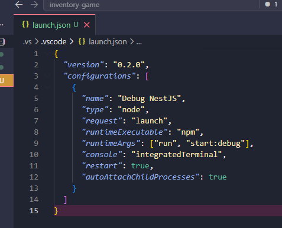
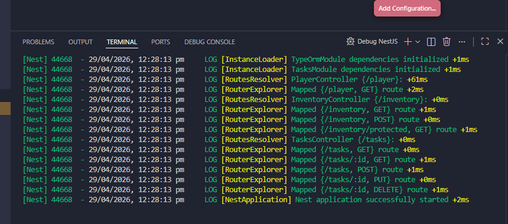
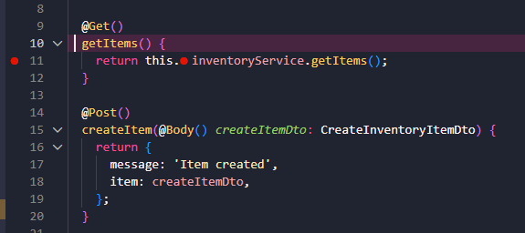
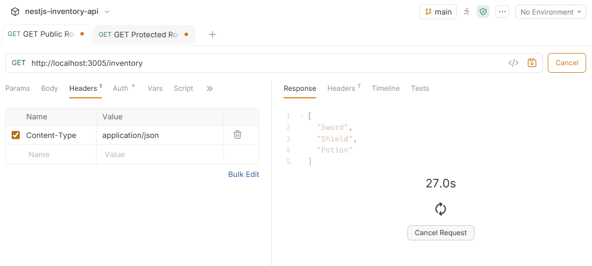
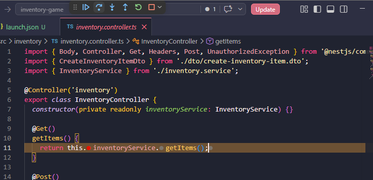

## Reflection 

### How do breakpoints help in debugging compared to console logs?

- Breakpoints pause the application at a specific line, allowing full inspection of variables, function flow, and application state at that moment. Unlike console logs, which only show predefined outputs, breakpoints provide a more flexible and detailed view of what is happening in the code. They also allow stepping through execution line by line, making it easier to identify where issues occur.

### What is the purpose of launch.json, and how does it configure debugging?

- Launch.json is used to define how VS Code should run and debug the application. It specifies the runtime, scripts, and settings required to start the NestJS app in debug mode. This configuration enables features such as breakpoints, step execution, and variable inspection by connecting the debugger to the running application.

### How can you inspect request parameters and responses while debugging?

- Request parameters and responses can be inspected by placing breakpoints inside controller methods and triggering requests using a tool like Bruno. When execution pauses, the Variables panel in VS Code can be used to view values such as headers, query parameters, and request body data. Stepping through the service layer also allows observation of how the response is processed before being returned.

### How can you debug background jobs that don’t run in a typical request-response cycle?

- Background jobs can be debugged by placing breakpoints inside the job processor or worker functions rather than controller routes. Since these jobs are triggered asynchronously, they must be initiated (for example, by adding a job to a queue) while the debugger is running. Once triggered, execution will pause at the breakpoint, allowing inspection of job data and processing logic.

## Task

- Created a launch.json file inside the .vscode folder. This file tells VS Code how to start the NestJS app in debug mode

- Started the debugger in VS Code using the Debug NestJS configuration. This runs the server in debug mode so breakpoints can pause the code

- Added a breakpoint in the controller to pause the request when the endpoint is called. This helps inspect how the request first enters the backend. 

- Added a breakpoint in the service to inspect the business logic after the controller passes the request through.

- Used Bruno to send a GET request to the NestJS API and trigger the breakpoint in VS Code.

- Used the debugging controls like Step Over and Step Into to move through the code line by line and observe variable values during execution.

- By using breakpoints and stepping through the code, it was possible to clearly see how data flows from the controller to the service and how each part of the application behaves during execution. This approach is much more effective than relying only on logs, as it allows real-time inspection of variables and logic