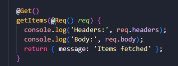
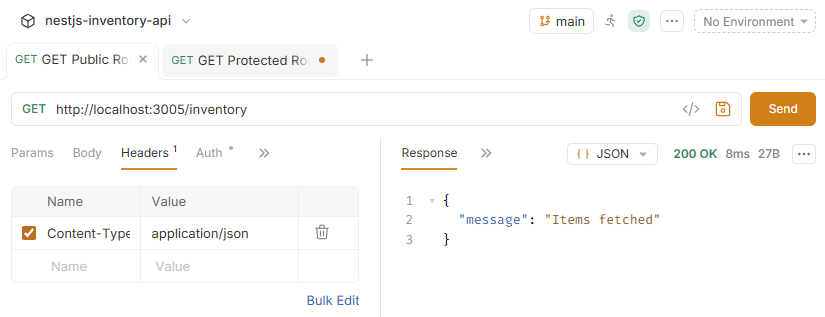
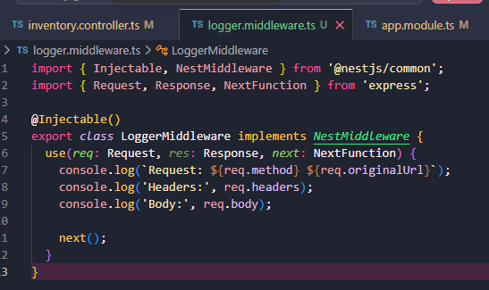
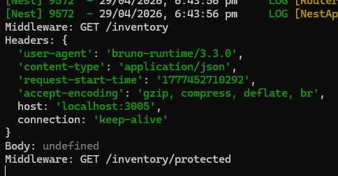

## Reflection 

### How can logging request payloads help with debugging?
- Logging request payloads helps identify what data is actually being sent to the backend. This makes it easier to spot issues such as missing fields, incorrect formats, or unexpected values. By comparing the incoming request with what the API expects, problems can be quickly narrowed down without guessing

### What tools can you use to inspect API requests and responses?
- Tools such as Bruno, Postman, and curl can be used to inspect API requests and responses. Bruno and Postman provide a visual interface for sending requests and viewing responses, while curl is useful for quick command-line testing. These tools allow developers to check headers, payloads, status codes, and response data

### How would you debug an issue where an API returns the wrong status code?
- Debugging this issue involves checking both the controller and service logic to see where the response is being set. Breakpoints or logs can be added to trace the flow of execution and confirm whether the correct conditions are being met. It is also useful to inspect the request data and verify that the expected input is being received, as incorrect input can lead to unexpected status codes

### What are some security concerns when logging request data?
- Logging request data can expose sensitive information such as authentication tokens, passwords, or personal data. If logs are not properly managed, this information could be accessed by unauthorised users. To reduce risk, sensitive fields should be masked or avoided in logs, and logging should be limited to only what is necessary for debugging

## Task 

- Updated the GET method in the controller to log incoming request data, including headers and body. This makes it easier to see exactly what the client is sending and helps identify issues such as missing or incorrectly formatted data

- Tested the endpoint using Bruno by sending a GET request to the API. The response returned a 200 OK status, confirming that the endpoint is functioning correctly and the server is handling requests as expected.

- Created a logger.middleware.ts file to log request details before they reach the controller. The middleware captures the request method, URL, headers, and body, providing a consistent way to monitor incoming API traffic across the application.

- Reviewed the terminal output after sending requests from Bruno. The logs clearly show the request method, endpoint, and headers, confirming that the middleware is successfully intercepting requests. The body appears as undefined for GET requests, which is expected as GET requests typically do not include a payload.

- By logging request data in both the controller and middleware, it became easier to trace how requests are received and processed by the backend. Testing the endpoint in Bruno and verifying the 200 OK response confirmed that the API was functioning correctly. Overall, using logging alongside API testing tools provides a clear view of application behaviour and is an effective approach for identifying and resolving issues during development.