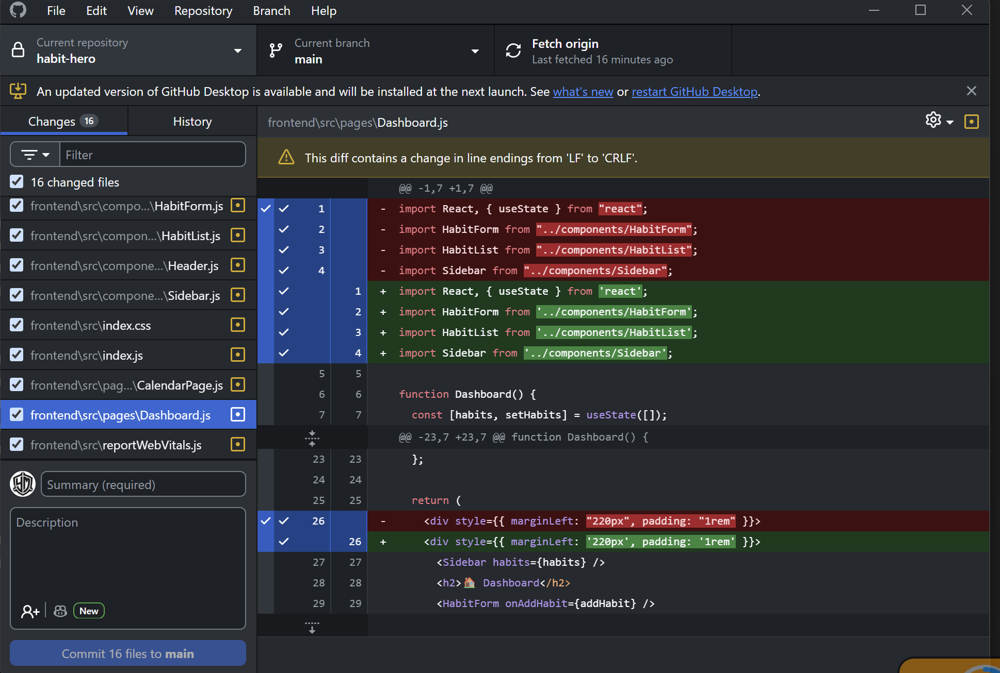

## Reflection

### Why is code formatting important?
- it keeps the project consistent and easier to read. When every file follows the same style, its easier to understand the code faster and work across different components.

### What issues did the linter detect?
- The linter detected style issues such as inconsistent quotes, JSX formatting problems, and use of the array index as a React key. It also highlighted parts of the code that could be written in a clearer way.

### Did formatting the code make it easier to read?
- Yes, formatting made the code easier to read.  Spacing, indentation, and JSX structure became more consistent. It made components look cleaner and easier to follow. It would matter more at a bigger project however did make my small project look more consistent too.

## Code 
- I used code from an old project, Habit Hero. Its a small full-stack JavaScript habit tracker, built with a React frontend and backend support for managing habits, tasks, and progress. I formatted 
- Github link: https://github.com/01YM/habit-hero/tree/main
