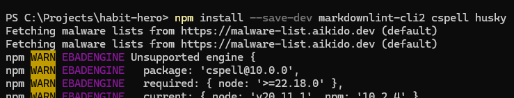
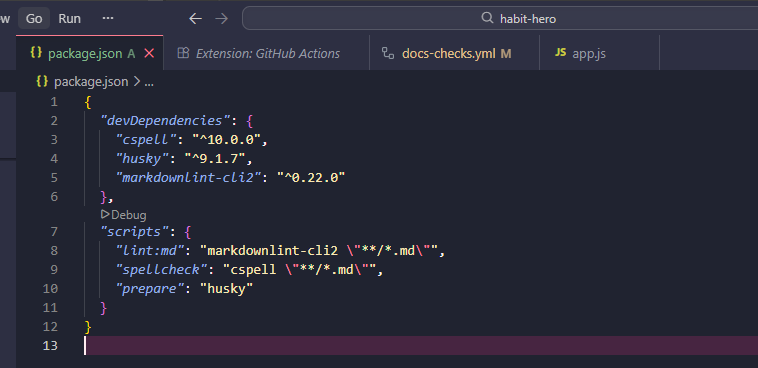
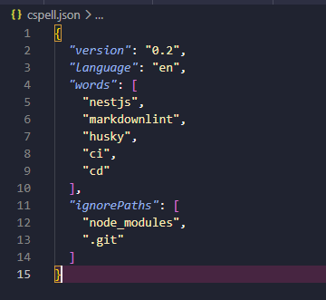
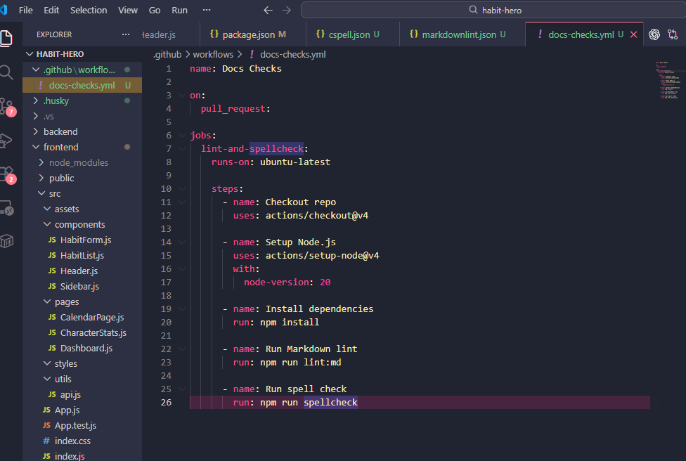
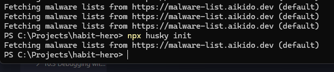
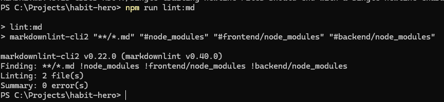
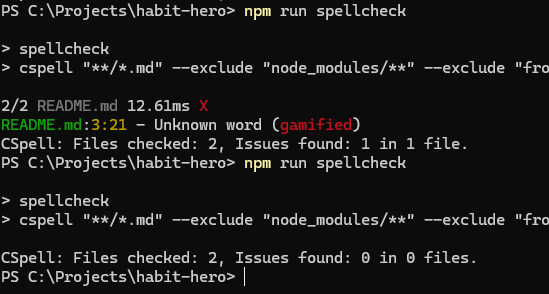

## Reflection 

### What is the purpose of CI/CD?
- it makes software development faster, safer and reliable. Everytime new code is pushed its automatically tested and deployed after passing the testing. This makes finding bugs and problems early on easier and reduces chances of broken code getting deployed into production. 

### How does automating style checks improve project quality?
- Helps keep the code clean and consistent throughout the whole project. Formatting, unused variables, missing semicolons and other issues are automatically checked for. 

### What are some challenges with enforcing checks in CI/CD?
- in some cases it slows down development if devs need to fix many small issues before merging their code. Large projects have a longer pipeline time for all the tests, builds and checks that are needed to run. 

### How do CI/CD pipelines differ between small projects and large teams?
- Large teams have a lot more complex pipelines with several stages. Those could be security scans, multiple test environments, code reviews, deployment approcals and monitoring. 

## Task 

- first installing the Markdown linter, the spell checker, and Husky for Git hooks so the project can automatically check Markdown formatting, spelling mistakes, and enforce rules before code is committed

- - Github link: https://github.com/01YM/habit-hero/tree/main

- adding scripts to the root package.json file so there are simple commands that can quickly run the Markdown linter and spell checker without typing the full commands every time 

- adding a .cspell.json file in the root of the project to define custom words that should not be marked as spelling mistakes and to ignore folders like node_modules 

- adding a docs-checks.yml file inside .github/workflows so GitHub Actions will automatically run the Markdown and spelling checks whenever a pull request is opened 

- running npx husky init to create the .husky folder and set up a pre-commit hook so the checks run automatically before every commit 

- running npm run lint:md to test that the Markdown linting is working correctly and to find formatting issues that need to be fixed before committing 

- ran npm run spellcheck to check all Markdown files for spelling mistakes and then fixed the flagged words by updating the .cspell.json file with allowed custom words

