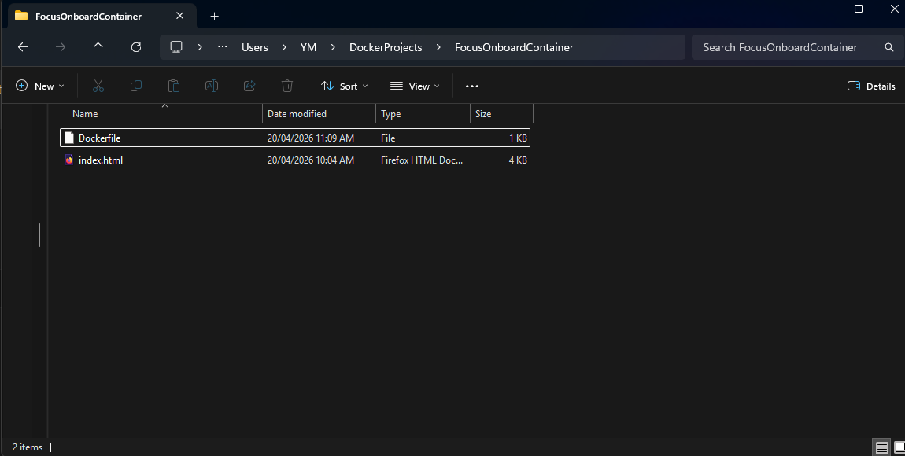
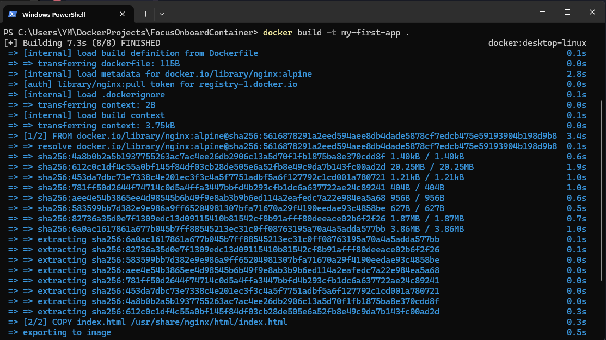
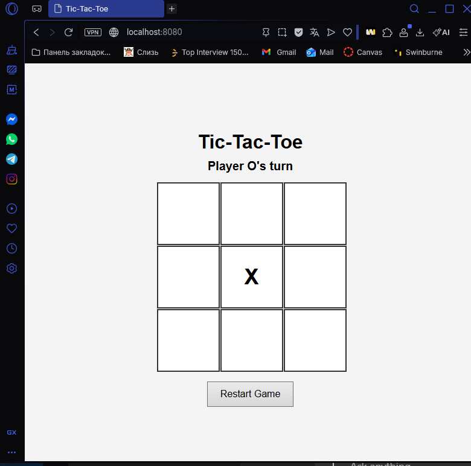
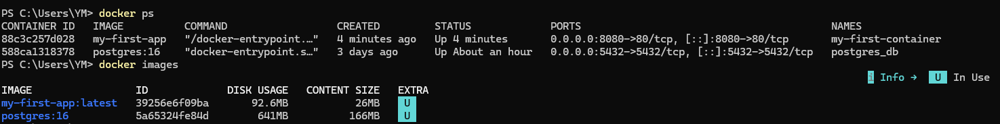
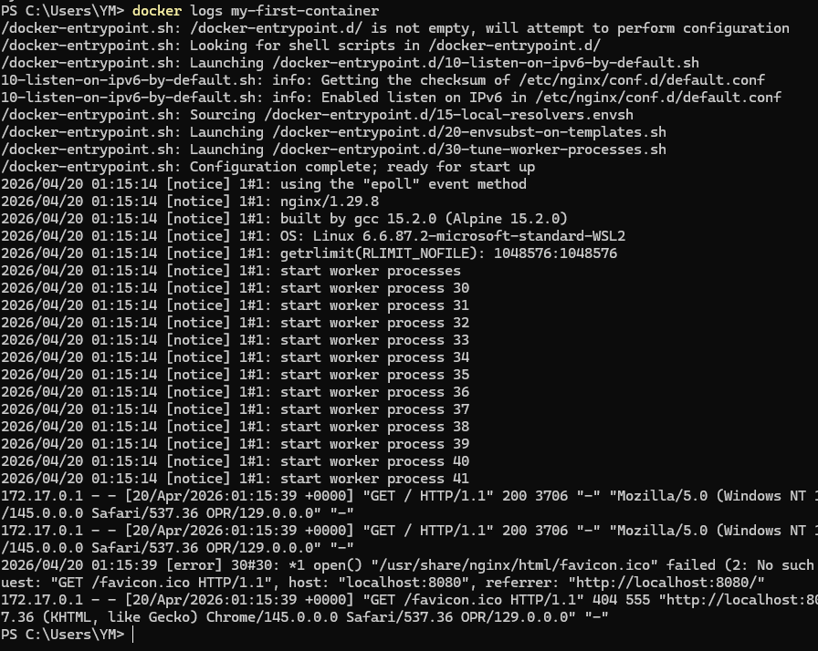
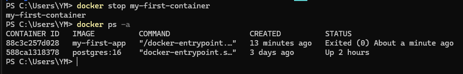

## Reflection

### What is the difference between docker run and docker-compose up?
- Вocker run starts one container and is usually used when you need one container at a time. Since backend probably uses multiple services at the same time its likely that the compose up command would be used way more often. docker compose up starts all services from the compose file. So for example it will start the backend container, database container, frontend container and etc. 

### How does Docker Compose help when working with multiple services?
- it starts and stops all services together, automatically connects containers, keeps the setup the same for every dev, lets you define all services in one file.
 
### What commands can you use to check logs from a running container?
- docker logs <container>
- docker logs -f <container> 
- docker compose logs 
- docker compose logs -f 

### What happens when you restart a container? Does data persist?
- yes, the data stays the same since the container is being used. But if a container is deleted and recreated, the data will be lost. Docker volume is used to prevent that data loss by strong the data outside of its container. This way the data wont be lost and its useful for recovering user information. 

## Task -- Exploring Docker 

- Ive created a simple HTML Tic-Tac-Toe game to test Docker, the project folder contains the game file and Dockerfile

- Building  docker image using docker build -t my-first-app .

- Running  the container and openning it in the browser

- Testing docker ps to see running containers and docker images to see the saved package of my applications 

- docker logs show that the web server inside the container started correctly and finished loading the settings. The website also opened in the browser and the server handled the request correctly. 

- after using docker stop and docker ps -a, it showed that the container was stopped and the status updated to exited 

