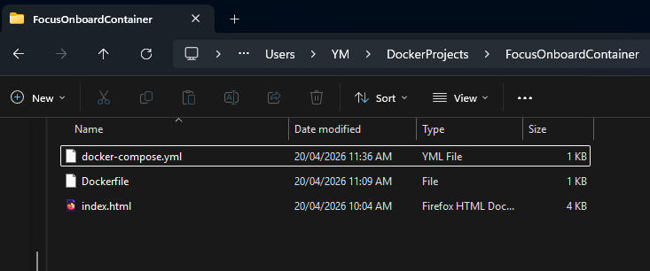
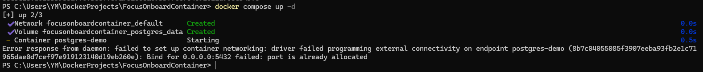
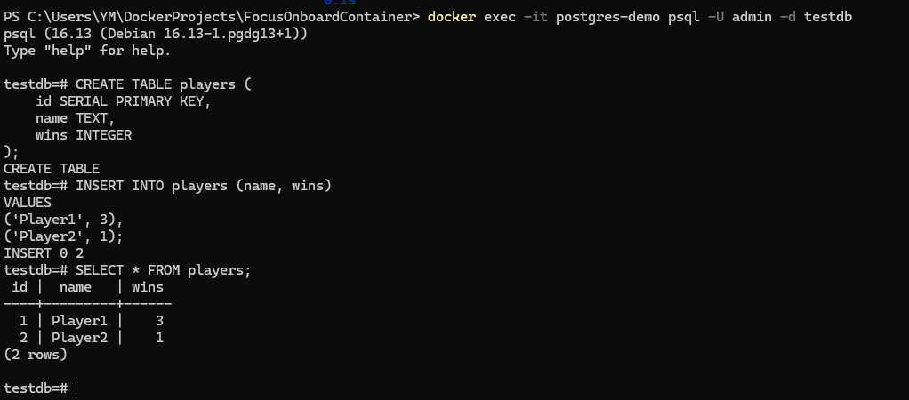
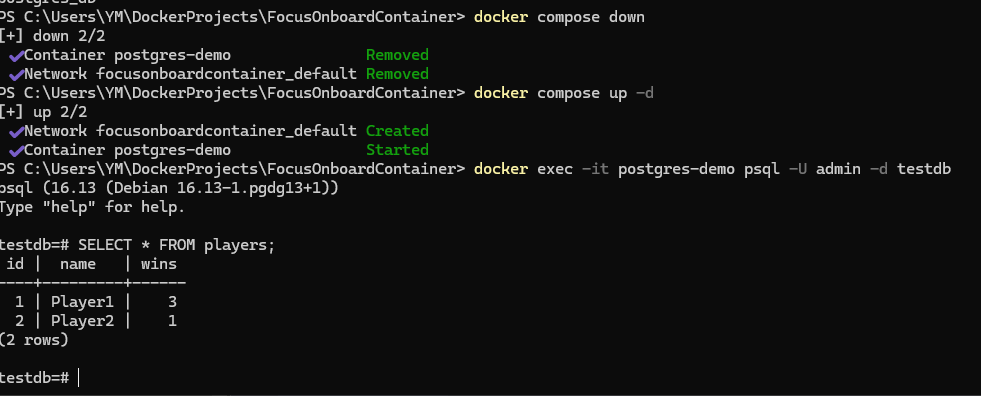

## 5.3 Reflection 

### What are the benefits of running PostgreSQL in a Docker container?
- It doesnt have to be installed locally
- all devs have the same environment so its consistent on different pcs
- Its also easy to remove and recreate the container that holds postgresql. 

### How do Docker volumes help persist PostgreSQL data?
- if the container with postgresql is deleted, docker volumes will recover the data inside it. So for example all the player progress is stored locally and it wont get wiped everytime you need to replace the container with posttgresql.  

### How can you connect to a running PostgreSQL cont
- through the cmd using a postgrade client like psql or by installing a graphical interface tool like pgadmin or dbeaver. You would then need the containers port, database name, username and password.  D

## Task 
- Ive created a yml file in the tictactoe project folder

- Running docker compose up -d 

- restarted the container, and ran:' docker exec -it postgres-demo psql -U admin -d testdb ' this connects me to the PostgreSQL database running inside the container. Then I created a test table and inserted some values into it.

- Now I use docker compose down to remove the container, then compose up to recreate it. After reconnecting to the database and checking the data, we can see that the data has been saved since it was stoerd outside with docker volume. 

