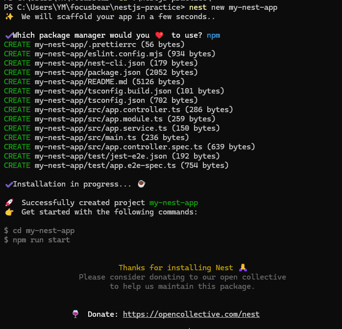
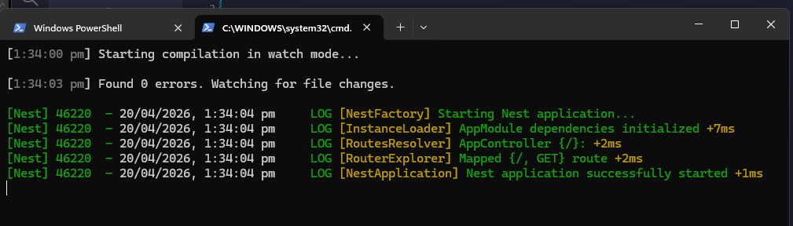
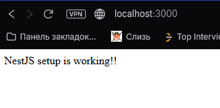

## Reflection 

### What files are included in a default NestJS project?

- main.ts: starts the NestJS application 
- app.module.ts: connects the main parts of the app together
- app.controller.ts: handles incoming requests from users 
- app.service.ts: stores the business logic of the app
- app.service.spec.ts: tests whether the controller works correctly 
- node_modules folder: contains all installed packages and libraries
- test folder: contains end to end tests for checking if app works correctly

### How does main.ts bootstrap a NestJS application?
 
- it imports NestFactory and AppModule, creates a nest application object and starts a server on port 3000. Its the main file that starts the whole app, teslls which module to load first and then strats the server so the app can receive requests from the browser

### What is the role of AppModule in the project?

- Its the root module of the whole porject that tell what controllers, services and other modules belong to the app. A module can hold controllers, providers, imports and exports which keep everything organized

### How does NestJS structure help with scalability?

- Everything is grouped and related files stay together. For example, a user feature might have its own module, controller, and service all in one place. As the application grows, devs can add new feature modules without making the codebase very messy. Different team members can work on different modules without affecting each other too much. This structure also makes it easier to reuse code, test features, fix bugs, and maintain the app

## Task 

- installing nestjs and making a new project 

- exploring the files inside the new default project and running the developement server

- runninng localhost:3000 after changing the text in app.service.ts to test that the default endpoint is working

