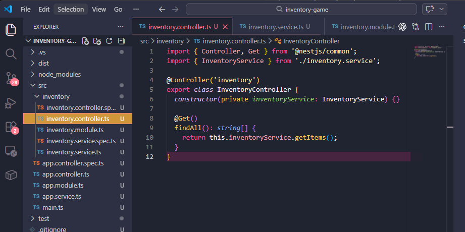
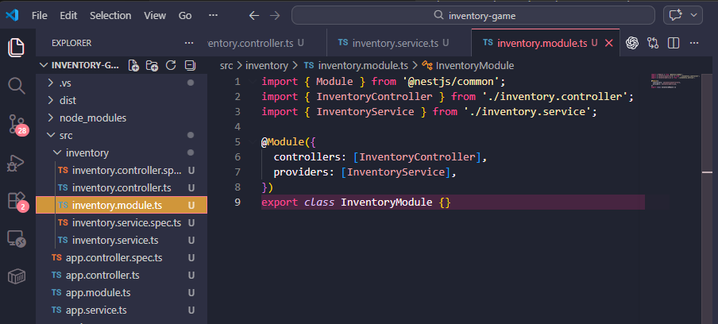
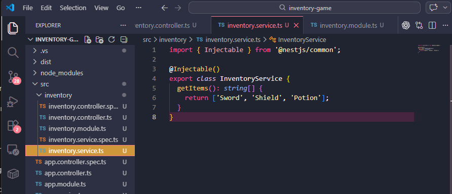
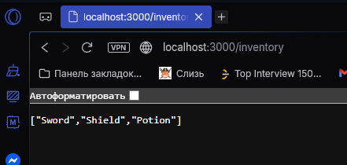

## 6.3 Reflection 

### What is the purpose of a module in NestJS?
- Its used to group related parts of the app together. It organizes features by keeping the controller and provider for a feature in one place. In the Intentory example I made below, the inventory has its own module, controller and a service. This made the project easy to understand and will make furture improvements easy to add as well.

### How does a controller differ from a provider? 
- The controller handles incoming requests and sends responses back. The Provider does the main logic. So the controller is like the part that receives the request, while the provider is the part that does the real work, such as getting data or processing it.

### Why is dependency injection useful in NestJS? 
- it saves you from manually creating services inside every controller. For exampple, the InventoryController does not create InventoryService itself. Instead, NestJS automatically gives the service to the controller through the constructor. This keeps the code cleaner and makes it easier to test, edit and scale
### How does NestJS ensure modularity and separation of concerns?
- NestJS separates different jobs into different files. InventoryController only handles requests, the InventoryService only handles the inventory logic, and the InventoryModule groups them together
## Task -- Controlelr with module 

- This example is a simple application for inventory API. It lets you view a player's items through a NestJS endpoint

- This file handles the /inventory route and sends the inventory items back when the endpoint is visited

- This file groups the inventory controller and inventory service together as one feature

- This file stores the inventory logic and returns the list of items

- This endpoint lets you test the inventory feature and see the returned items in the browser