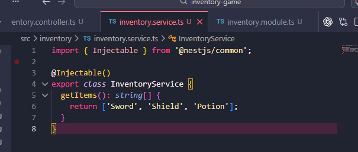

## Reflection

### How does dependency injection improve maintainability?

-  classes do not need to manually create the services they use. In the inventory app I wrote earlier, the controller can receive InventoryService through the constructor instead of building it itself. This keeps the code clean, makes changes easier later, and testing simpler or in other words improves the maintainability

### What is the purpose of the @Injectable() decorator?

- its to mark a class as a provider that NestJS can manage in its dependency injection system. In the inventory app, adding @Injectable() to InventoryService tells Nest that this service can be created and injected where it is needed

### What are the different types of provider scopes, and when would you use each?

- NestJS has three provider scopes: singleton, request, and transient.
1. Singleton is the default and is best for most services since one shared instance is used for the whole app
2. Request scope is useful when a provider needs request-specific data, because a new instance is created for each request
3. Transient scope is useful when every consumer should get its own separate instance, like a custom logger

### How does NestJS automatically resolve dependencies?

- by reading what a class asks for in its constructor and then finding matching providers that were registered in the module. In the inventory example, when InventoryController asks for InventoryService, Nest sees that InventoryService is a provider in the module and gives it to the controller automatically
