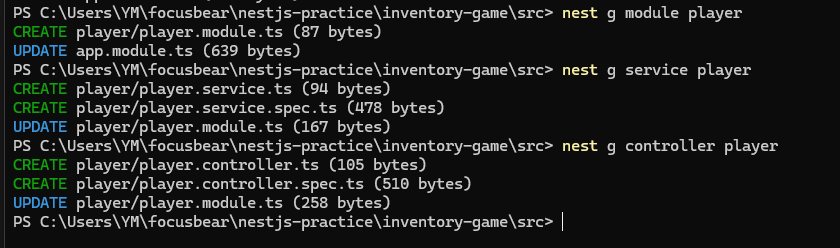

## Reflection

### How does the NestJS CLI help streamline development?

- by creating files and project structure automatically instead of building everything by manually. It also helps run and build the app, so development is faster and more organized.

### What is the purpose of nest generate?

- its used to create NestJS files from ready-made templates. For example, you can use it to generate a module, controller, service, middleware, guard, or even a full CRUD resource

### How does using the CLI ensure consistency across the codebase?

- because it creates files in the same NestJS style every time. Features are organized in the same way, which makes the project easier to read, maintain, and grow.

### What types of files and templates does the CLI create by default?

- modules, controllers, providers, services, middleware, guards, pipes, interceptors, decorators, libraries, and full CRUD resources. When creating a controller or service, it commonly also creates .spec.ts. test files

## Task 

- Im adding a player component to inventory system in the nestJS application. using the CLI, adding the player module, service and controller

