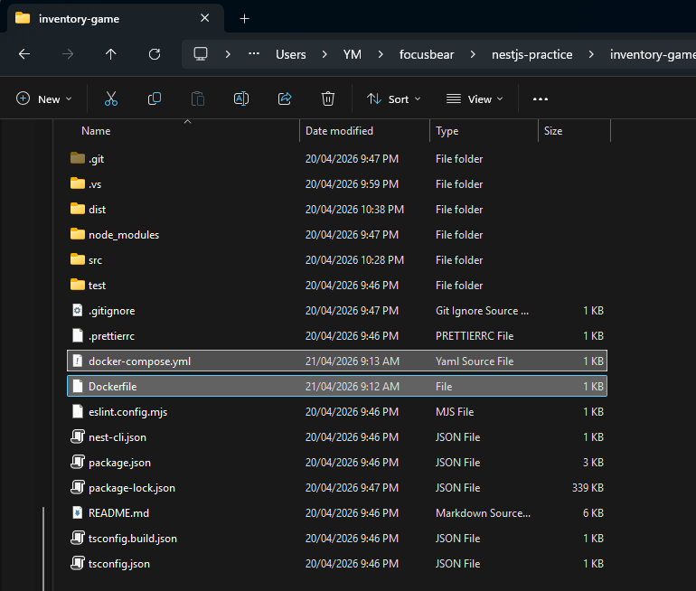
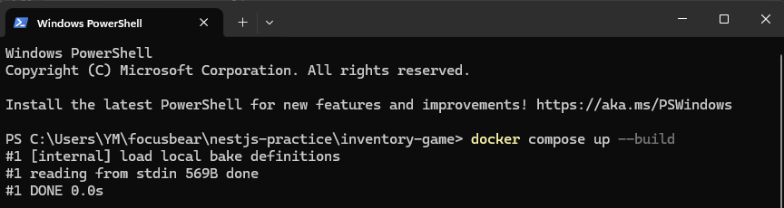
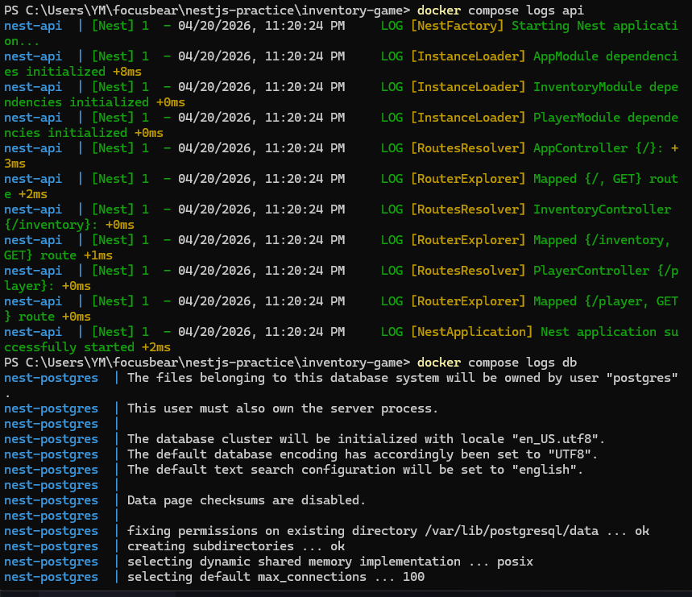
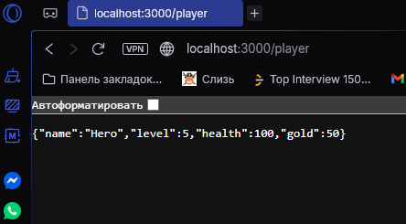

## Reflection

### How does a Dockerfile define a containerized NestJS application?

- it defines the steps Docker should follow to package a NestJS app into a container image. It says which base image to use, where the app files go, how dependencies are installed, how the NestJS project is built, which port is exposed, and what command starts the app

### What is the purpose of a multi-stage build in Docker?

 - its used to make the final image smaller and cleaner. One stage builds the NestJS app, and another stage keeps only the files needed to run it, so the final container does not carry unnecessary build tools or dev dependencies

### How does Docker Compose simplify running multiple services together?

- by letting me define the API and PostgreSQL inside one file and start them together with one command. Instead of running each container separately and wiring them manually, Compose handles the services, ports, environment variables, and shared network in the same place

### How can you expose API logs and debug a running container?

- with commands like docker compose, logs api, and docker compose logs db. For debugging, you can also inspect the running containers with docker compose ps and open a shell inside a container with a command like docker exec -it nest-api sh to look around and test things directly. NestJS also has a built-in logger that prints startup messages and exceptions, which helps when reading container logs

## Task 
- github link: https://github.com/01YM/nestjs-inventory-game
- made a dockerfile with a docker-compose.yml in the root of the nestJS project so Docker knows how to build the NestJS app container and run it together with PostgreSQ

- built and started both containers using docker compose up --build, which created one container for the NestJS API and another container for the PostgreSQL database

- used docker compose ps, docker compose logs api, and docker compose logs db to check that both containers were running correctly and that NestJS and PostgreSQL started without errors 

- Opened the local /player route in the browser to confirm that the NestJS container was working and returning data correctly.

