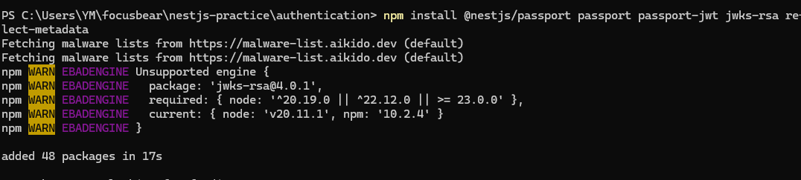
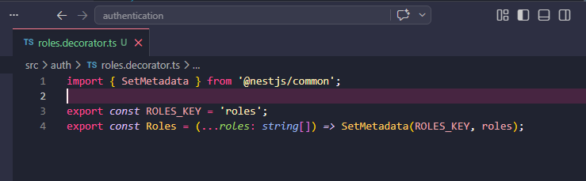
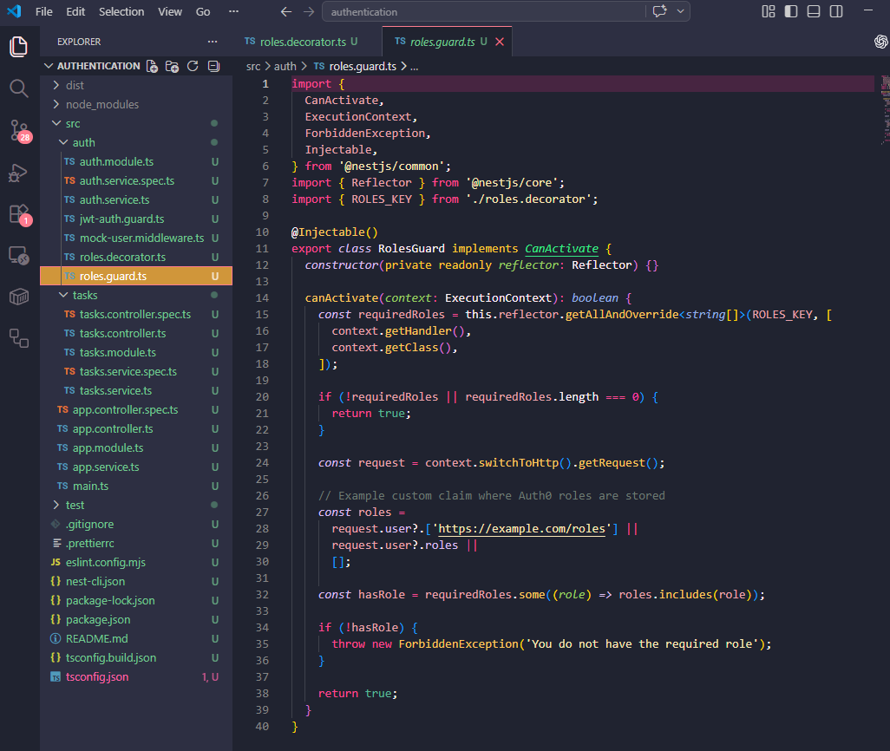
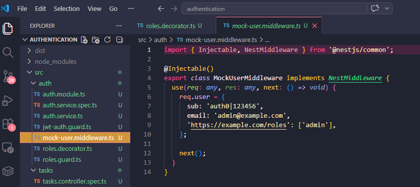
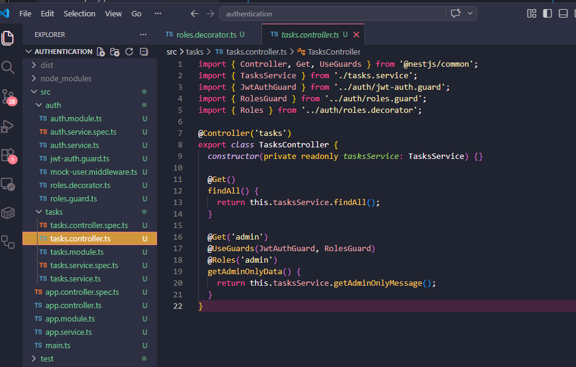
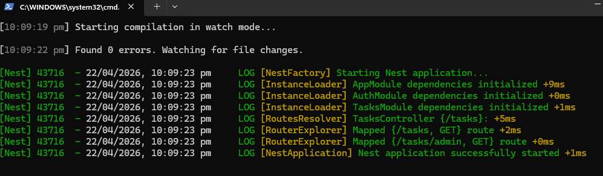
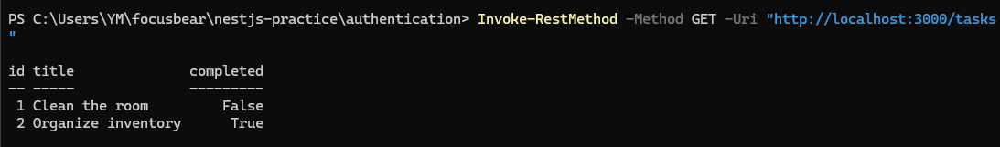
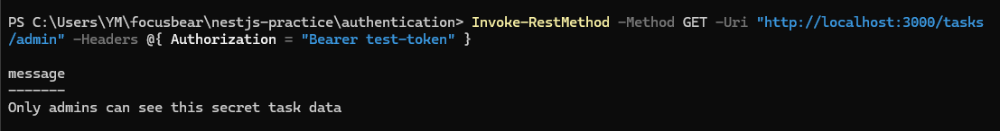

## 8.1 Reflection 

### How does Auth0 store and manage user roles?

- By assigning them to users inside its authorization system. Each role can have different permissions attached to it. For example, an admin role may be allowed to create, edit, and delete data, while a normal user role may only be allowed to view data. In this task, the mock user had the admin role, which allowed access to the protected /tasks/admin endpoint.

### What is the purpose of a guard in NestJS?

- Its used to decide whether a request should be allowed to continue or be blocked. It runs before the controller method is executed. In the task, the JWT guard checked if a Bearer token was included in the request, and the roles guard checked if the logged-in user had the correct role.

### How would you restrict access to an API endpoint based on user roles?

- Adding a roles decorator to the endpoint and using a roles guard. For example, adding @Roles('admin') means only users with the admin role are allowed to use that route.

### What are the security risks of improper authorization, and how can they be mitigated?

- If authorization is not set up correctly, users may be able to access data or actions they should not have permission for. This can be prevented by using guards, checking roles correctly, validating tokens properly, and only giving users the minimum permissions they need.

## Task 

- Installed the packages needed for JWT token checking, Passport integration, and Auth0-style authorization after creating the new NestJS project

- Created the custom Roles decorator code. This decorator is used to mark routes with required roles such as admin, so the application knows which type of user is allowed to access a specific endpoint

- Created the roles.guard.ts file and added the role check logic. The guard reads the required role from the decorator and compares it with the roles stored on the current user. If the user does not have the correct role, access is denied

- Created the mock-user.middleware.ts file to simulate a logged-in Auth0 user. This middleware adds a fake user object with an admin role so the RBAC logic can be tested without needing a real Auth0 login.

- Updated the tasks.controller.ts file to protect the admin route. The controller uses both the JWT guard and the roles guard, and only users with the admin role are allowed to access the /tasks/admin endpoint

- Ran the NestJS application using npm run start:dev to start the local development server

- Tested the protected admin endpoint successfully using a Bearer token. Because the mock user had the admin role, the request was allowed and returned the protected admin-only response

- Changed the mock user role from admin to user and tested the protected endpoint again. This time the request was blocked and returned a forbidden error because the user no longer had the required role

