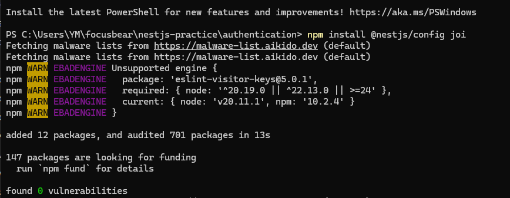
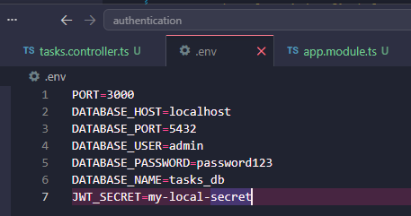
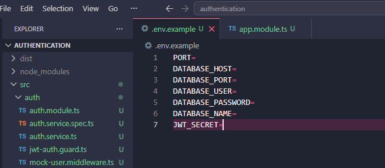
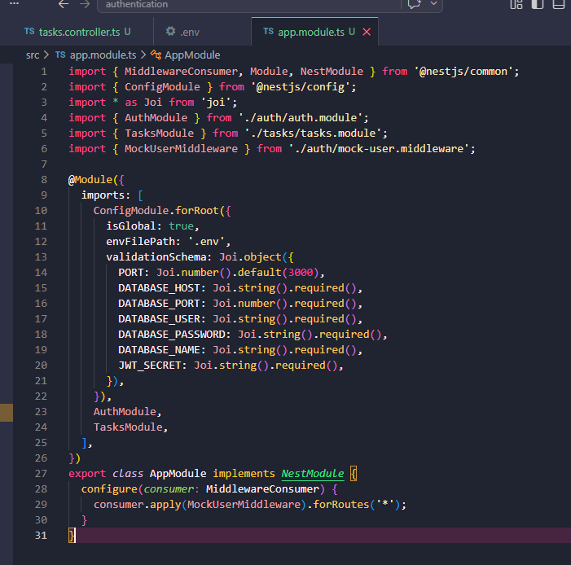
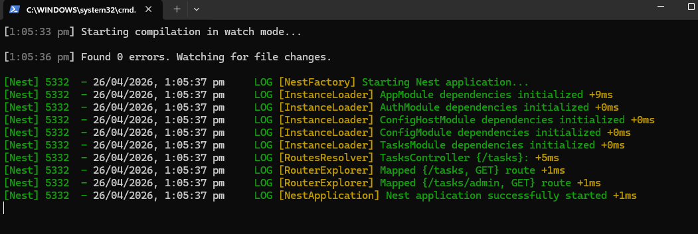
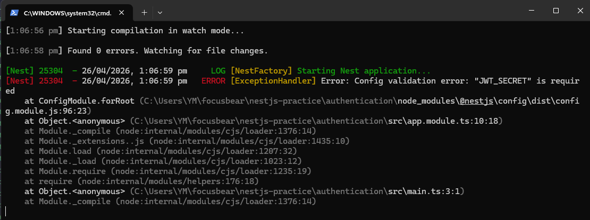

## 8.2 Reflection

### How does @nestjs/config help manage environment variables?
- @nestjs/config helps the app read values from the .env file instead of hardcoding them in the code. In this task, things like PORT and JWT_SECRET were stored in .env and loaded into the app. This makes it easier to change values without editing the code

### Why should secrets (e.g., API keys, database passwords) never be stored in source code?
- The code can be shared or uploaded to GitHub. If secrets are inside it, other people can see them and misuse them. In this task, the secrets were kept in .env and not committed to Git, which keeps them safe

### How can you validate environment variables before the app starts?
- You can validate environment variables using Joi inside ConfigModule. It checks if required values exist and if they are correct. When JWT_SECRET was removed from .env, the app failed to start, showing that validation is working

### How can you separate configuration for different environments (e.g., local vs. production)?
- You can use different .env files for different environments, like .env for local and .env.production for deployment. This way, the app can use different settings depending on where it is running, without changing the code

## Task 

- Installed @nestjs/config and joi. These are used to read environment variables and check that required values exist 

- Updated the .env file with values like port, database info, and JWT secret. This keeps sensitive data outside the code

- Created an .env.example file. This shows what variables are needed without showing real secrets

- Updated app.module.ts to use ConfigModule and Joi validation. This loads the .env file and checks values before the app starts 

- Started the app with npm run start:dev to check everything works

- Removed a secret from .env and restarted the app. The app failed, showing validation is working 

- I set up environment configuration in the NestJS app by adding @nestjs/config, creating a .env file, and validating variables with Joi. Sensitive data was kept out of the code and made the app easier to manage across different environments. The app now safely reads configuration from .env, and will stop running if important values are missing

