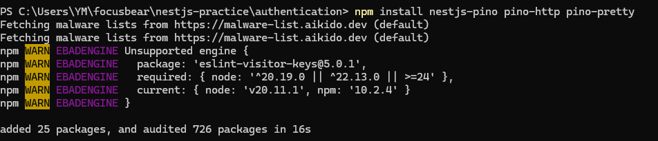
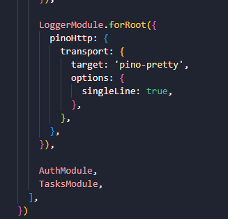
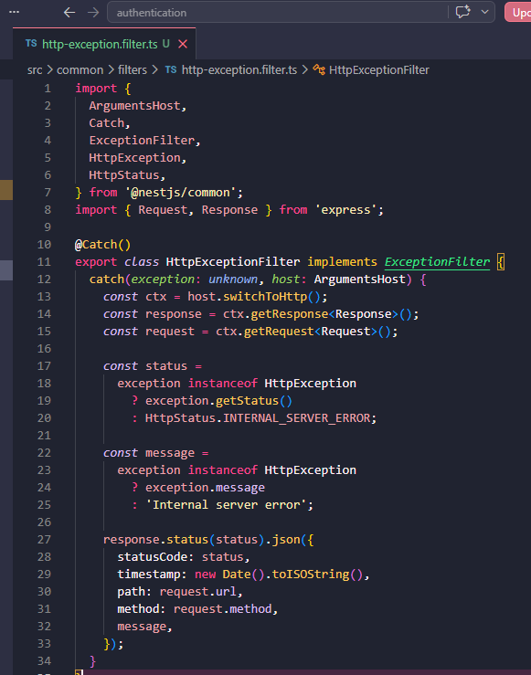
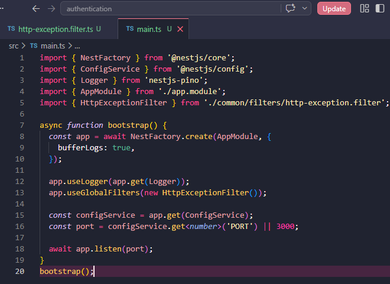
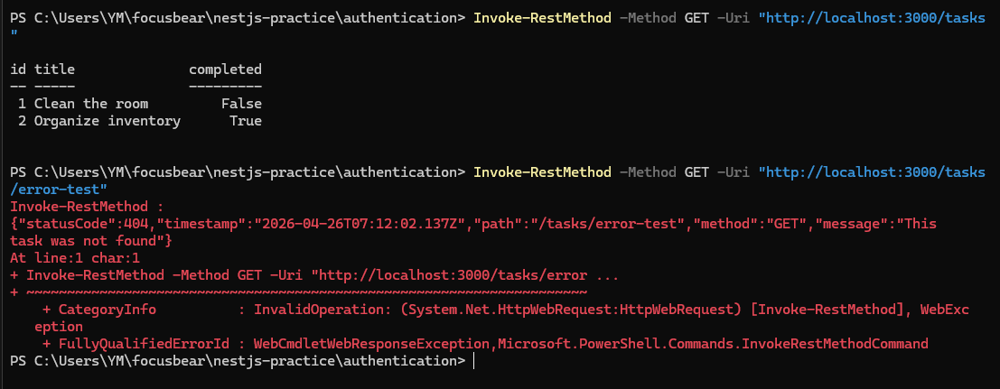
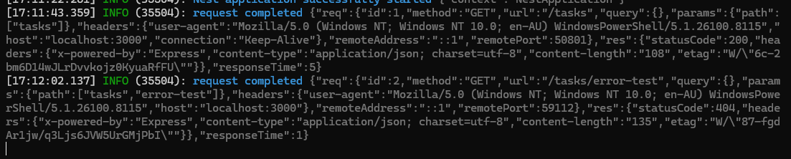

## Reflection 

### What are the benefits of using nestjs-pino for logging?

- The logs are easier to read, search, and use for debugging. In the given task, Pino was added so the app can log requests and errors in a better format instead of only using basic console logs

### How does global exception handling improve API consistency?

- It makes all API errors look the same. This helps the frontend and developers understand errors more easily. In this task, the custom exception filter returned the same structure for errors, including the status code, timestamp, path, method, and message

### What is the difference between a logging interceptor and an exception filter?

- A logging interceptor is mainly used to watch requests and responses, such as how long a request took or which route was called. An exception filter is used when something goes wrong and an error needs to be caught and formatted. In this task, nestjs-pino handled logging, while the custom exception filter handled the error response format

### How can logs be structured to provide useful debugging information?

- Logs should include useful details like the request method, route path, status code, timestamp, and error message. This makes it easier to find what happened when something breaks. Pino logged request information, and the exception filter returned clear error details for debugging in the task below

## Task
- Github link: https://github.com/01YM/nestjs-authentication
- Installed nestjs-pino and related packages. These are used to add structured logging to the NestJS app, so requests and errors are logged clearly instead of using basic console logs 

- Updated app.module.ts to include the Pino logger module. This connects structured logging to the whole application so every request and response is automatically logged 

- Created a custom exception filter file. This is used to catch errors and return them in a consistent format instead of random error responses

- Updated main.ts to use the Pino logger and register the global exception filter. This makes logging and error handling apply to the entire app

- Started the server and tested two requests. The first request worked normally, while the second request triggered an error to test the exception handling 

- One request to /tasks returned status 200 (success), and another to /tasks/error-test returned a 404 error, including the method, URL, headers, and response time for debugging

