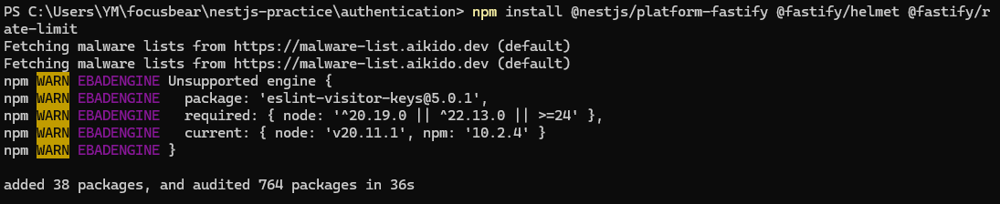
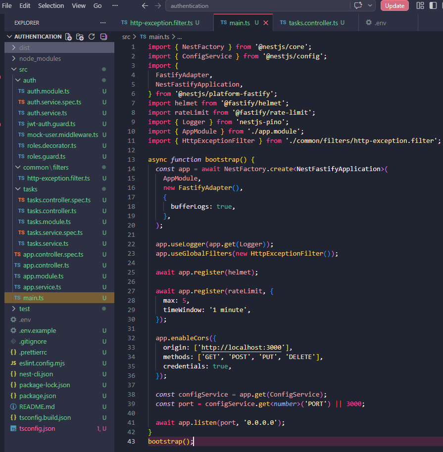
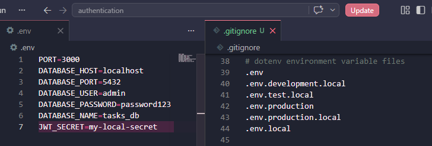
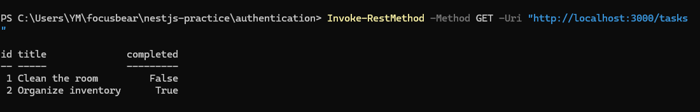
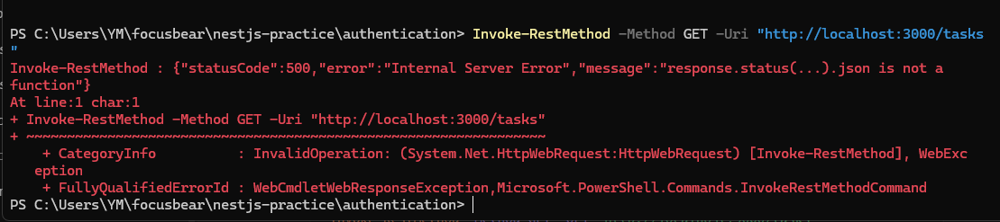

## Reflection

### What are the most common security vulnerabilities in a NestJS backend?

- Unsafe user input, weak authentication, bad authorization, exposed secrets, open CORS settings, and too many requests from one user. For example, if a NestJS app allows every website through CORS, a bad website may be able to call the API when it should not

### How does @fastify/helmet improve application security?

- It adds safer HTTP headers to the app’s responses. These headers help protect the app from some browser-based attacks. In this task, Helmet was added in main.ts, so the app can send more secure responses automatically

### Why is rate limiting important for preventing abuse?

- It stops one user or bot from sending too many requests in a short time. Without it, someone could spam the API or try many login attempts very quickly. In this task, the limit was set to 5 requests per minute, so the app blocks extra requests after the limit is reached

### How can sensitive configuration values be protected in a production environment?

- Sensitive values should be stored in environment variables, not directly in the code. Files like .env should also be added to .gitignore so they are not uploaded to GitHub. In production, secrets should be stored in a secure place like the deployment platform’s environment settings or a secret manager

## Task 

- Installed Fastify and security packages (@nestjs/platform-fastify, @fastify/helmet, @fastify/rate-limit). These are used to improve backend security by adding safer HTTP headers and limiting how many requests a user can send

- Updated main.ts to use the Fastify adapter and register Helmet and rate limiting. This makes the app more secure by protecting responses and preventing request spam 

- Making sure the .env holds the secrets and .gitignore files incluse the .env so it doesnt get uploaded and instead is stored locally. 

- Tested the normal endpoint to make sure the API still works correctly after adding the security features  

- Tested rate limiting by sending multiple requests quickly. After reaching the limit, the app blocked further requests, showing that protection against abuse is working

