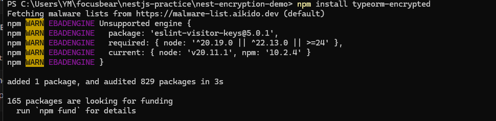
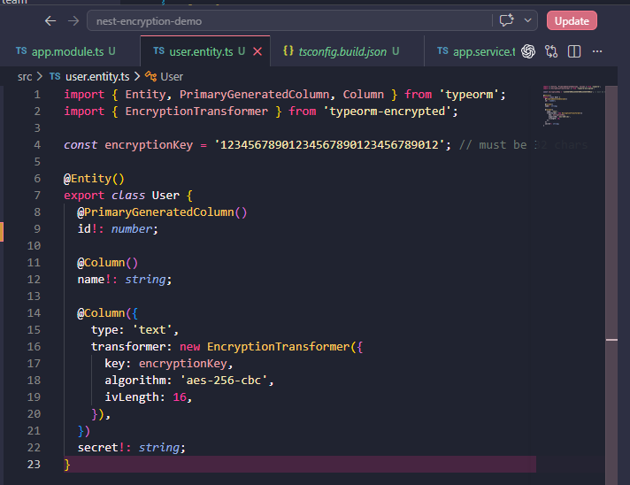
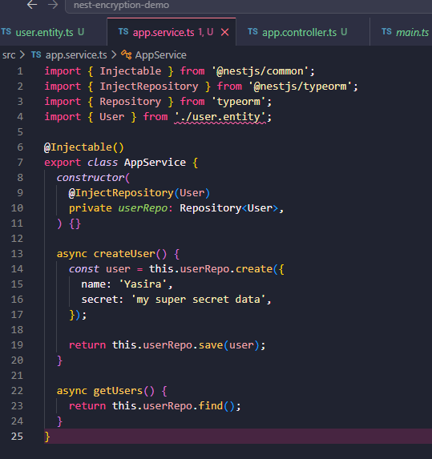
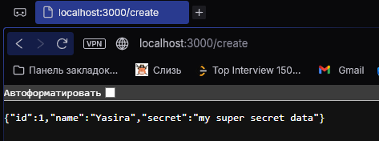
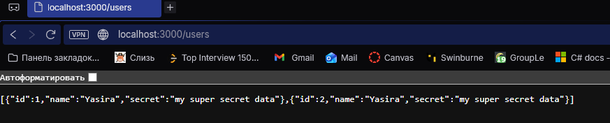

## Reflection

### Why does Focus Bear double encrypt sensitive data instead of relying on database encryption alone?

- One layer of protection is not always enough. Database encryption protects the database storage, but application-level encryption protects the actual field before it even reaches the database. For example, in this task, the secret field is encrypted by the NestJS app using EncryptionTransformer before TypeORM saves it. This means that even if someone looks directly inside the database, the sensitive field is not easy to read

### How does typeorm-encrypted integrate with TypeORM entities?

- Typeorm-encrypted works by using a TypeORM column transformer. The transformer is added inside the entity column definition. When data is saved, it encrypts the value. When data is read, it decrypts the value. In this task, the secret field in the User entity used EncryptionTransformer, so the app could still work with normal text while the database stored encrypted text

### What are the best practices for securely managing encryption keys?

- Encryption keys should never be hardcoded in the source code or uploaded to GitHub. They should be stored in environment variables, secret managers, or secure deployment settings. In this task, the encryption key was hardcoded inside user.entity.ts for simplicity, but in a real application it should be moved to a .env file or secure storage. In production, real keys should be strong, random, rotated when needed, and only available to services that truly need them.

### What are the trade-offs between encrypting at the database level vs. the application level?

- Database-level encryption is easier to manage because the database handles it, but the app may still send and receive readable data. Application-level encryption gives stronger protection for specific fields because data is encrypted before it reaches the database. In this task, the secret field is encrypted in the NestJS app before being stored. The trade-off is that application-level encryption needs more setup, careful key management, and can make searching or filtering encrypted fields harder.

## Task 

- Installed the required packages to enable field-level encryption and provide a simple local database for testing.

- Created the user entity and applied EncryptionTransformer to securely encrypt sensitive data before storing it in the database

- Implemented the service logic to save and retrieve user data, allowing us to test how encryption and decryption work automatically

- Triggered the create endpoint to store data in the database, verifying that the encryption process runs when saving data

- Called the get users endpoint to confirm that encrypted data in the database is automatically decrypted when retrieved by the application

