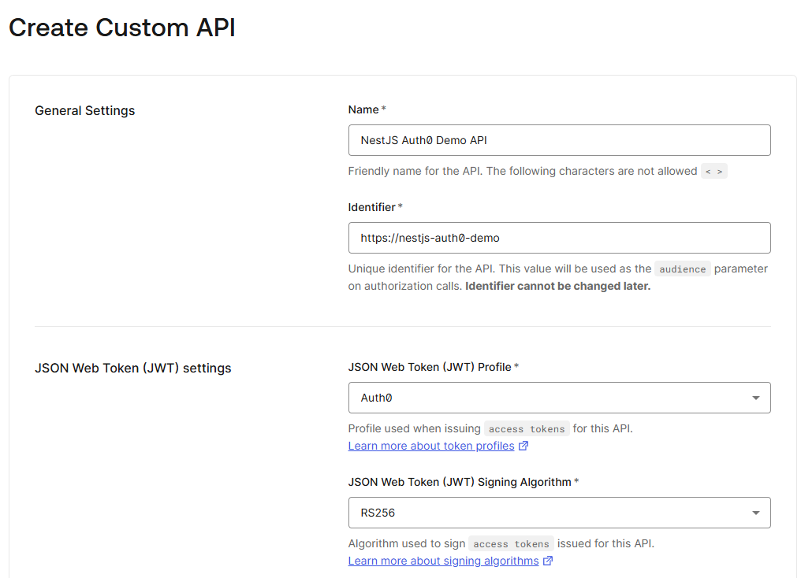
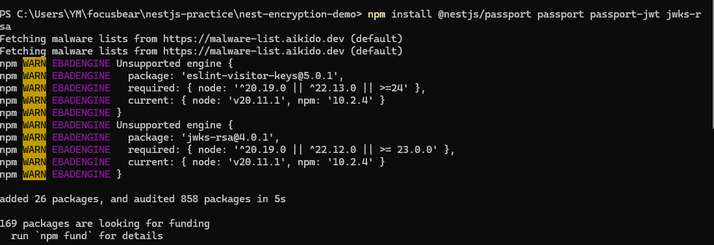
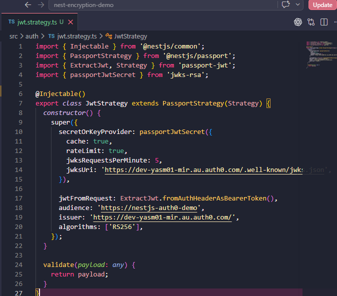
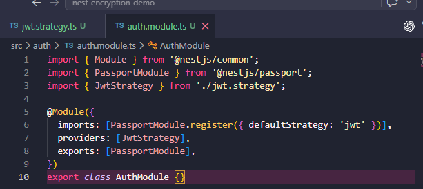
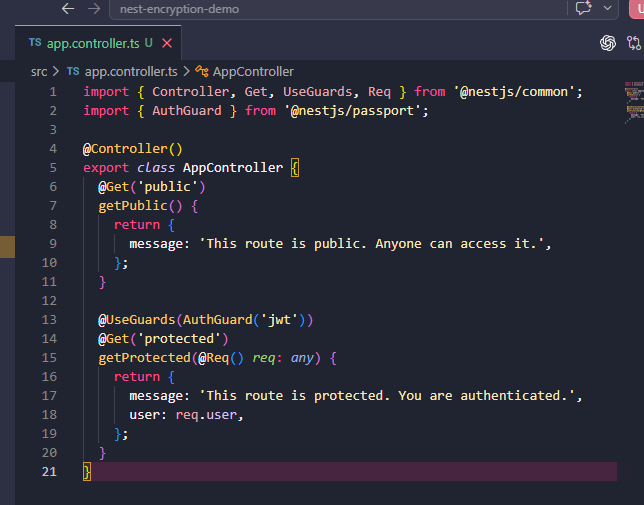
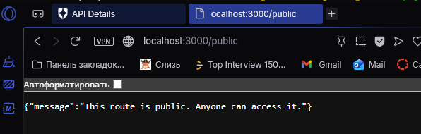
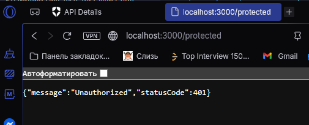
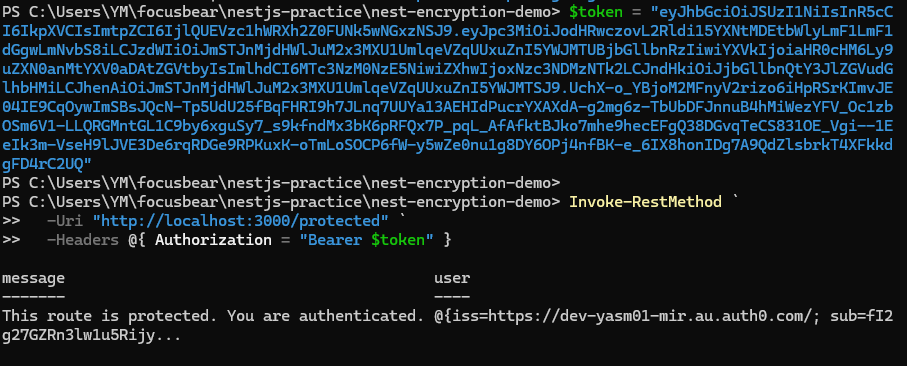

## Reflection
### How does Auth0 handle authentication compared to traditional username/password auth?

- Its outsourcing the login process to a secure external service instead of the application managing usernames and passwords directly. In a traditional system, the app stores user credentials and verifies them, which increases security risk. With Auth0, users log in through Auth0, and the NestJS app only receives a token, meaning the app never directly handles or stores sensitive login details.

### What is the role of JWT in API authentication?

- JWT is used as proof that a user has successfully authenticated. After logging in through Auth0, the user receives a JWT, which is sent with API requests. In this project, the NestJS app checks the JWT in the Authorization header to verify the user’s identity before allowing access to protected routes.

### How do jwks-rsa and public/private key verification work in Auth0?

- Auth0 signs JWTs using a private key, and the NestJS app verifies them using a public key. The jwks-rsa library fetches the correct public key from Auth0’s JWKS endpoint. When a request is made, NestJS uses this key to verify that the token was issued by Auth0 and has not been tampered with.

### How would you protect an API route so that only authenticated users can access it?

- In NestJS, API routes are protected using guards. In this project, the AuthGuard('jwt') was applied to the protected route. This ensures that any request must include a valid JWT from Auth0, otherwise access is denied with an Unauthorized error.

## Task 

- Created an Auth0 API in the dashboard. This defines the backend API that will be protected and provides the audience and settings needed for JWT validation in the NestJS app

- Installed authentication-related packages such as @nestjs/passport, passport-jwt, and jwks-rsa. These are used to handle JWT authentication and allow the app to verify tokens issued by Auth0

- Created the jwt.strategy.ts file. This configures how the NestJS app validates JWT tokens by connecting to Auth0’s JWKS endpoint and checking the token’s issuer, audience, and signature

- Created the Auth module and registered the JWT strategy. This integrates authentication into the NestJS application so routes can use guards to require valid tokens 

- Updated the app.controller.ts to include both public and protected routes. The protected route uses AuthGuard('jwt') to ensure only requests with a valid token can access it

- Tested the public route using the browser. This confirms that routes without authentication can be accessed normally by any user

- Tested the protected route without a token. This returned an Unauthorized response, showing that the authentication guard is working correctly 

- Used the Auth0 access token to call the protected route. This verified that when a valid JWT is included in the request header, the app successfully authenticates the user and allows access 

