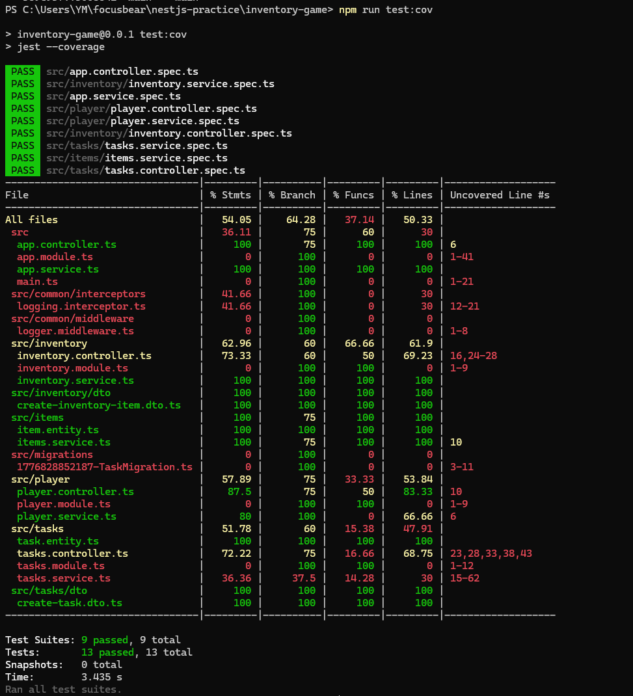
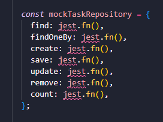
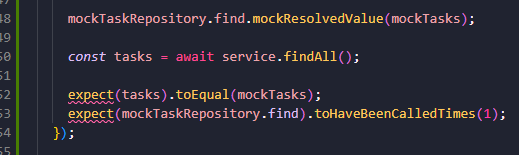
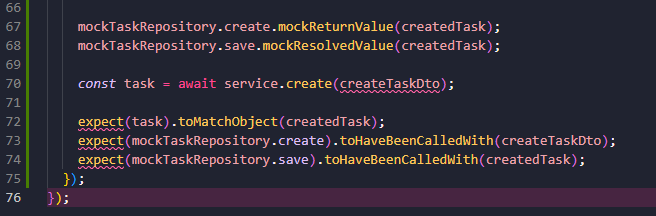
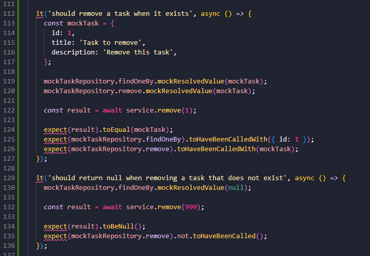
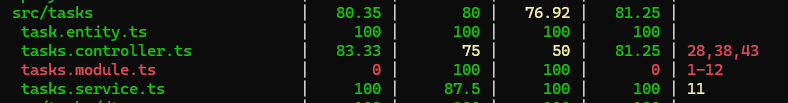

## Reflection 

### What does the coverage bar track, and why is it important?

- The coverage bar tracks how much of the code was run during tests. It usually shows coverage for lines, statements, functions, and branches. This is important because it helps show which parts of the code have been tested and which parts might still be risky or missed

### Why does Focus Bear enforce a minimum test coverage threshold?

- Focus Bear enforces a minimum coverage threshold to make sure new code is tested before it gets merged. This helps reduce bugs and keeps the app more reliable. Since Focus Bear is a habit tracker with focus sessions, broken backend logic could affect things like tasks, timers, reminders, or user progress, so testing is important

### How can high test coverage still lead to untested functionality?

- High coverage can still be misleading if the tests only run the code but do not properly check the result. For example, a test might call getItems() and increase coverage, but if it does not use expect() to check the returned data, it is not very useful. The code was touched, but the behaviour was not really tested

### What are examples of weak vs. strong test assertions?

- A weak assertion is something that only checks that a function exists or runs, like expect(service).toBeDefined(). That is okay as a basic check, but it does not prove the feature works. A stronger assertion checks the actual behaviour, like expect(service.getItemCount()).toBe(2) or checking that a mocked service was called with the correct data

### How can you balance increasing coverage with writing effective tests?

- The best balance is to write tests that cover important behaviour, not just lines of code. It is good to improve coverage, but each test should still have a clear purpose and meaningful assertions. For example, instead of only testing the happy path, it is better to also test edge cases like empty data, invalid input, and error responses

## Task 

- Ran npm run test:cov to generate the coverage report. This showed which parts of the code weren’t being tested, with the Tasks service and controller clearly showing up as low coverage areas

- Focused on improving coverage for the Tasks module. Added multiple test blocks to the controller (and similar ones for the service). These tests mock the service methods and check different controller behaviours like returning all tasks and creating a task

- For the controller specifically, tests were added that mock the TasksService using jest.fn() so the controller can be tested on its own. The findAll() method was tested to make sure it returns the correct data from the mocked service, and the create() method was tested to check that the controller passes the input properly to the service and returns the right result. Proper assertions like toEqual() and toHaveBeenCalledWith() were used instead of weak checks like toBeDefined(), so the tests actually confirm the behaviour, not just that the code runs

- Ran npm run test:cov again and confirmed that coverage improved a lot, with the Tasks service and controller now hitting much higher percentages (around 80–100%). This shows the new tests are covering the logic that was missed before

