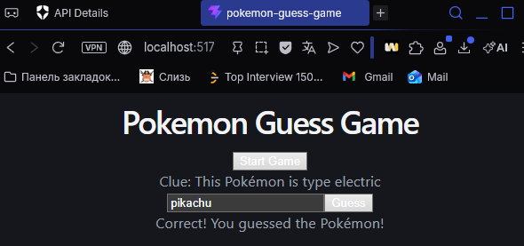
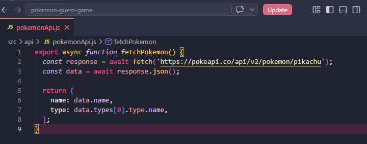
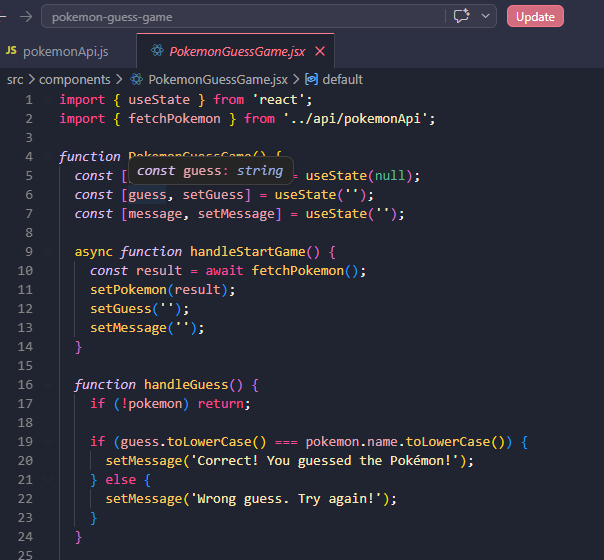
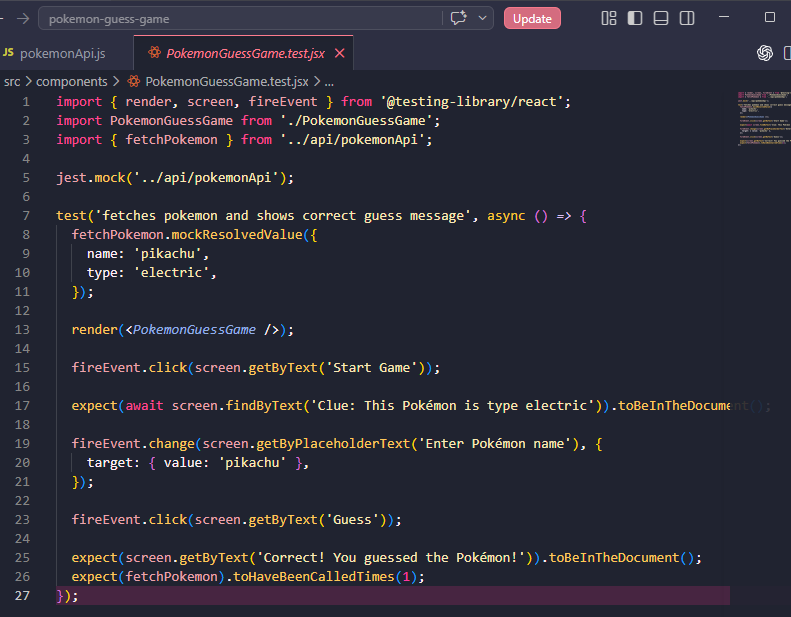
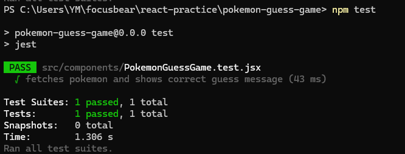

## Reflection 

### Why is it important to mock API calls in tests?

- It allows the test to run without depending on a real external server. Real APIs can be slow, unavailable, or return different data each time, which can break tests even if the code is correct. By mocking the API using jest.mock() and mockResolvedValue(), we control exactly what data is returned. In this task, the Pokémon API was mocked to always return “pikachu” and “electric”, which made the test stable and predictable

### What are some common pitfalls when testing asynchronous code?

- Not waiting for asynchronous code to finish before checking the result. This can cause tests to fail even when the code is correct. For example, if we used getByText instead of findByText, the test might run before the Pokémon data is loaded. Another issue is forgetting to use async/await, which can lead to incomplete tests. In this task, await screen.findByText(...) was used to wait for the UI to update after the mocked API call, so the test checks the correct result at the right time

## Task 
- Github link: https://github.com/01YM/pokemon-guess-game
- Built a Pokémon guessing game using React and ran it locally on localhost. The game allows the user to start a round, view a clue (Pokémon type), enter a guess, and receive feedback. After entering the correct guess, the UI updated dynamically to display a winning message, showing that React state and event handling are working correctly

- Created a separate API file to handle fetching Pokémon data. This keeps the data-fetching logic independent from the UI, making the code cleaner and easier to test. The function retrieves data from an external API and returns only the required fields (name and type)

- Developed the main React component for the game. This file manages the application state using useState, handles user interactions such as starting the game and submitting guesses, and conditionally renders UI elements like the clue, input field, and result message

- Implemented Jest mocking and test logic. The API call was mocked using jest.mock() and mockResolvedValue() to simulate API responses without making real network requests. The test then simulates user actions (clicking buttons, typing input) and verifies that the correct UI updates occur

- Ran the test suite using npm test. The passing result confirms that the component behaves as expected, the mocked API works correctly, and the game logic is functioning properly under test conditions

