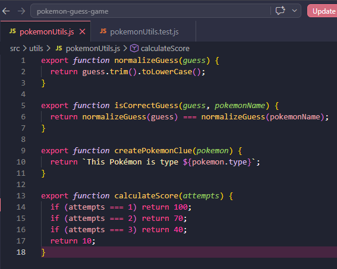
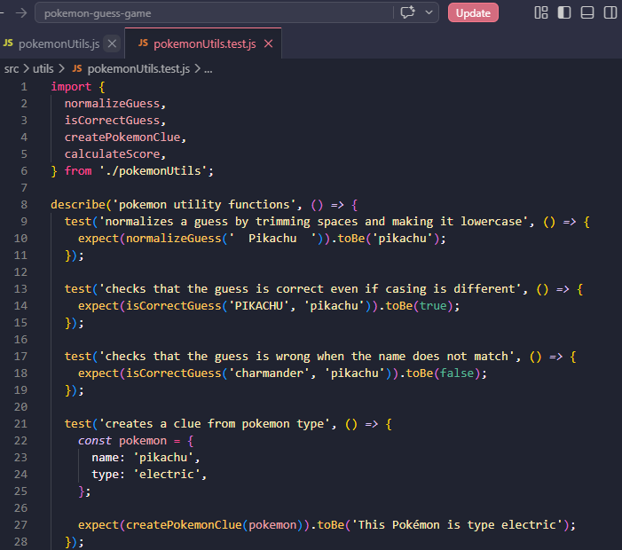
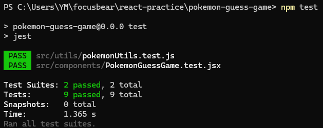

## Reflction

### Why is automated testing important in software development?

- Automated testing is important because it helps make sure the code works correctly without needing to manually check everything every time. It saves time and catches mistakes early before they become bigger problems. For example, in the Pokémon game, the tests automatically check if the guessing logic and utility functions work correctly. If I change something later, I can quickly run npm test and confirm that nothing is broken

### What did you find challenging when writing your first Jest test?

- The most challenging part was understanding how Jest works with React, while dealing with imports and asynchronous behaviour. Errors like “React is not defined” showed that Jest requires extra setup compared to running the app in the browser. Another challenge was knowing when to use await and functions like findByText to wait for updates

## Task 
- Github link: https://github.com/01YM/pokemon-guess-game
- Built on top of the existing Pokémon Guess Game by creating a separate utility file. This file contains reusable helper functions such as normalizing user input, checking if a guess is correct, generating clues, and calculating scores

- Created a corresponding test file for the utility functions. The tests verify different behaviours such as handling uppercase and extra spaces in guesses, correctly identifying matching and non-matching Pokémon names, generating the correct clue text, and calculating scores based on the number of attempts

- Ran the test using npm test. The passing results confirm that both the Pokémon game component and the new utility functions behave as expected

- Uploaded the project to GitHub, making the code accessible. 