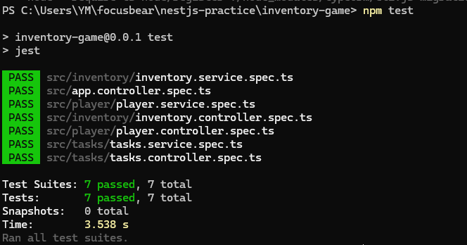
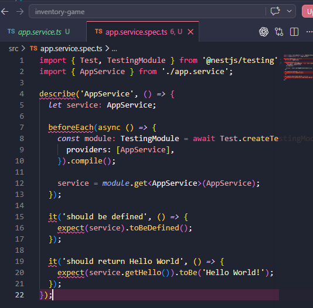
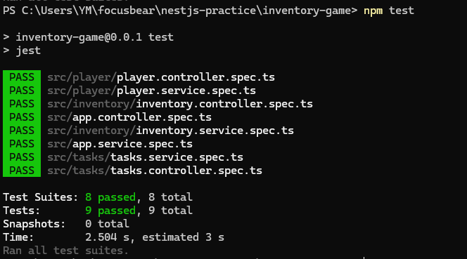

## Reflction 

### What are the key differences between unit, integration, and E2E tests?
- Unit tests check one small part of the app on its own, like a single service method. Integration tests check how a few parts work together, like a controller calling a service. E2E tests check the whole app from start to finish, sending a real request to an API and checking the response. In this task, the AppService test was a unit test because it only checked one function.

### Why is testing important for a NestJS backend?
- Testing is important because the backend handles things like APIs, logic, and data. If something breaks, it can affect everything. They help catch issues early before they become bigger problems. In this project, running npm test showed everything still worked after adding the new test, which gives confidence the app is stable.

### How does NestJS use @nestjs/testing to simplify testing?
- @nestjs/testing makes it easier to test parts of the app without running the whole server. You can create a small testing module and only include what you need. In this task, it was used to create a module and get the AppService, which made the test simple and easy to set up.

### What are the challenges of writing tests for a NestJS application?
- One challenge is understanding how dependency injection works, especially when services depend on other things like databases or APIs. You often need to mock those parts. Another challenge is knowing what type of test to write. Unit tests are simple, but bigger features might need integration or E2E tests

## Tasks 
- github link: https://github.com/01YM/nestjs-inventory-game
- Opened the NestJS inventory game project and ran npm test to make sure Jest was already set up and working. The results showed all the existing tests passing across different modules, which confirms the testing setup is working properly and the app is stable

- Created a simple service test using @nestjs/testing. This involved setting up a testing module, getting the AppService, and writing a couple of checks to make sure it’s defined and returns the expected value. This shows how NestJS testing works with dependency injection

- Ran npm test again after adding the new test. The output now shows more test suites and test cases, and everything is still passing. This confirms the new test was added correctly and didn’t break anything in the app

- By creating a simple service test and running it, it confirmed that the testing setup is already built into the project and working properly. It also showed that adding new tests doesn’t break existing functionality, which is important for keeping the app stable. Overall, testing makes it easier to catch issues early and gives confidence that the backend is working as expected.