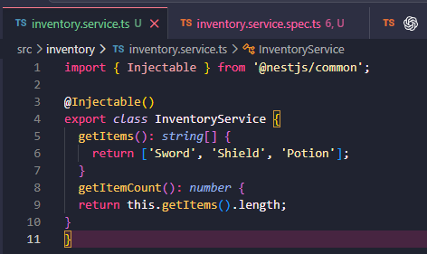
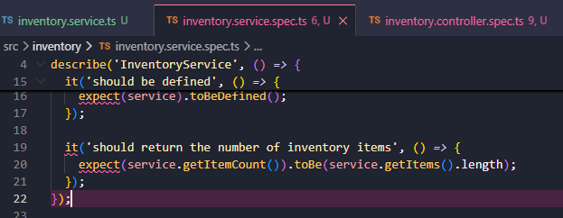
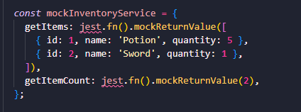
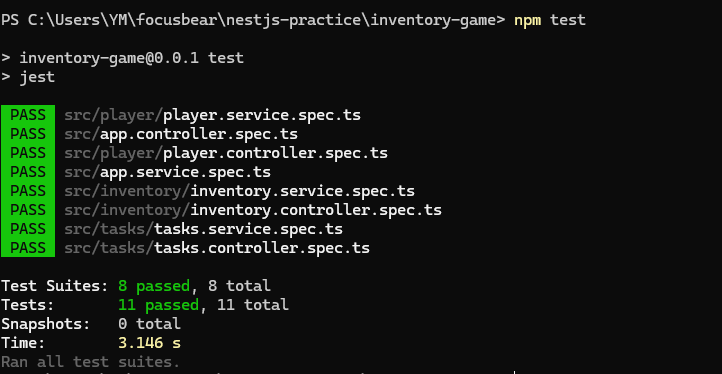

## Reflection 
### Why is it important to test services separately from controllers?

- Services and controllers have different jobs. A controller handles the API request and sends back a response, while a service usually contains the main logic. Testing them separately makes it easier to find where a problem is. In this task, the InventoryService was tested by itself to check that getItemCount() returned the correct value

### How does mocking dependencies improve unit testing?

- It replaces real dependencies with fake ones. This means the test can focus on one part of the app instead of depending on other files, databases, or APIs. In this task, the controller test used a mocked InventoryService with jest.fn(), so the controller could be tested without relying on the real service logic

### What are common pitfalls when writing unit tests in NestJS?

- A common issue is forgetting to provide dependencies in the testing module. If a controller needs a service but the service is missing, the test will fail before it even runs properly. Another pitfall is testing too many things at once, which makes the test harder to understand. It can also be easy to forget to check that mocked functions were actually called

### How can you ensure that unit tests cover all edge cases?

- By testing more than just the normal successful case. For example, if getItemCount() counts inventory items, it would be useful to also test what happens when the list is empty. For controller tests, you can test different mocked responses, invalid inputs, or empty data. This helps make sure the app still works even when the data is not perfect

## Task 
- github link: https://github.com/01YM/nestjs-inventory-game
- Added a simple getItemCount() method to the inventory service. This method counts how many inventory items exist, giving us a small piece of service logic that can be tested on its own 

- Updated the inventory service test to check the new getItemCount() method. The test confirms that the method returns the correct number of items, which shows how unit tests can be used to verify service logic

- Created a controller test using a mocked version of the inventory service. Instead of relying on the real service, the test uses fake data with jest.fn(), which makes the controller test more controlled and focused

- Ran npm test to check that all tests still pass. This confirms the new service and controller tests were added correctly and did not break the existing NestJS test suite

