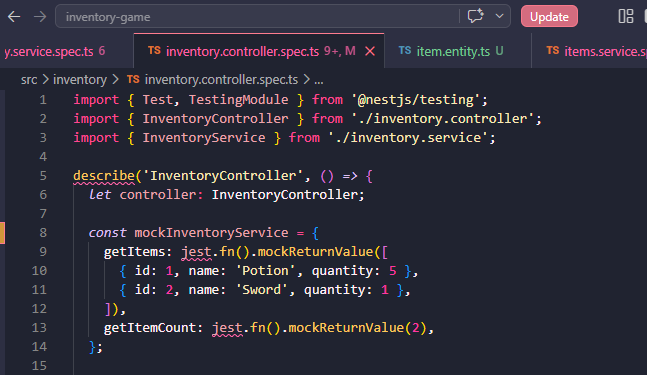
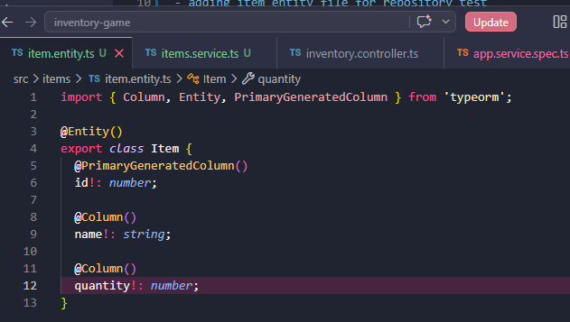
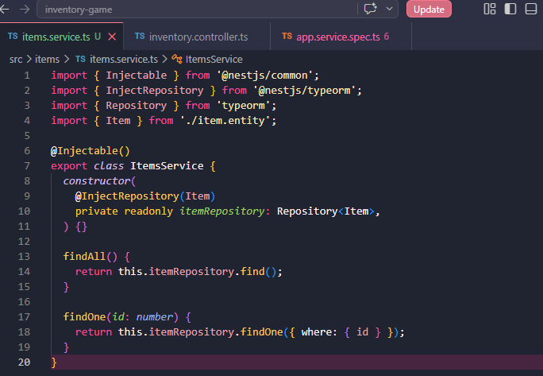
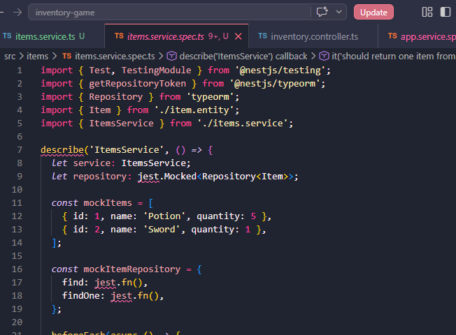
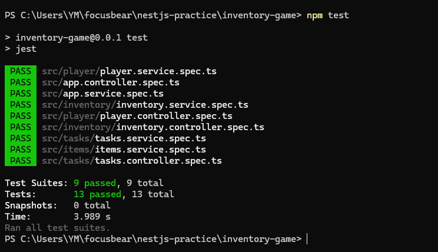

## Reflection 
### Why is mocking important in unit tests?
- Unit tests should focus on one small part of the app at a time. If a controller test uses the real service, then the test is checking both the controller and the service together. By mocking the service, the test becomes simpler and easier to understand. In this task, the InventoryService was mocked so the controller test could focus only on the controller behaviour

### How do you mock a NestJS provider, such as a service in a controller test?
- In NestJS, a provider can be mocked inside Test.createTestingModule() by using useValue. Instead of giving the test the real service, we give it a fake object with jest.fn() methods. For example, the controller test provided a mocked InventoryService with fake getItems() and getItemCount() methods. This let the controller test run without depending on the real service

### What are the benefits of mocking the database instead of using a real one?
- Mocking the database makes tests faster, safer, and easier to control. A real database can be slow, may not have the right data, or can change between test runs. With a mocked TypeORM repository, we can decide exactly what find() or findOne() should return. In this task, the item repository was mocked, so the service test could run without setting up PostgreSQL or connecting to a real database.

### How do you decide what to mock vs. what to test directly?
- I would test the main logic directly and mock anything outside the thing I am testing. For example, when testing a service method, I would test the service logic directly but mock the database repository. When testing a controller, I would mock the service because the controller should only be checked for how it handles the request and calls the service

## Task 

- Mocked the InventoryService inside the controller test. The controller test uses fake service data instead of the real service, so the test can focus only on checking that the controller calls the service correctly

- Added an Item entity file for the repository test. This defines the structure of an item in TypeORM, including fields like id, name, and quantity, so the service can work with item data in a database-style format

- Created an ItemsService file that uses a TypeORM repository. This service includes methods like findAll() and findOne(), which normally get data from the database through the repository

- Created an ItemsService spec file to test the service with a mocked TypeORM repository. The repository methods, such as find() and findOne(), were replaced with jest.fn() so the test could run without needing a real database 

- Ran npm test to check that all tests pass. The passing result confirms that the mocked service and mocked repository were set up correctly, and the new tests did not break the existing test suite

