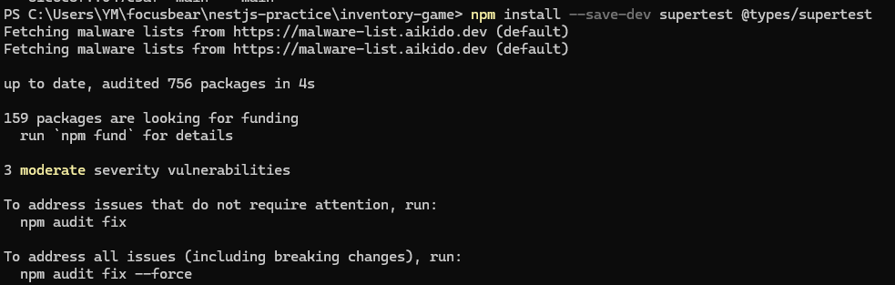
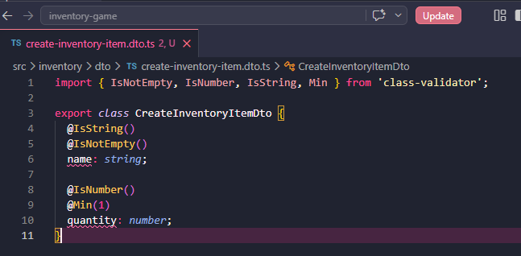
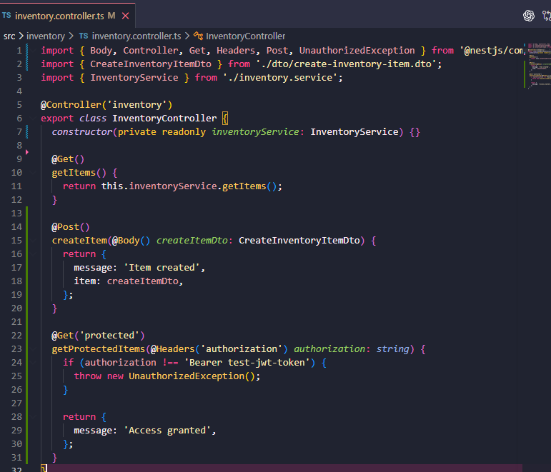
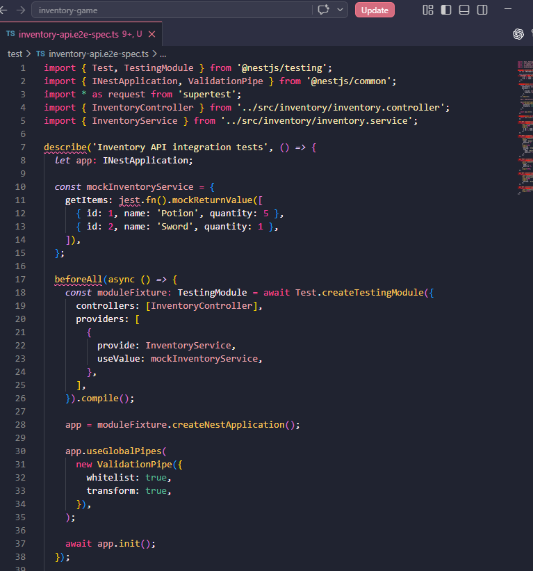
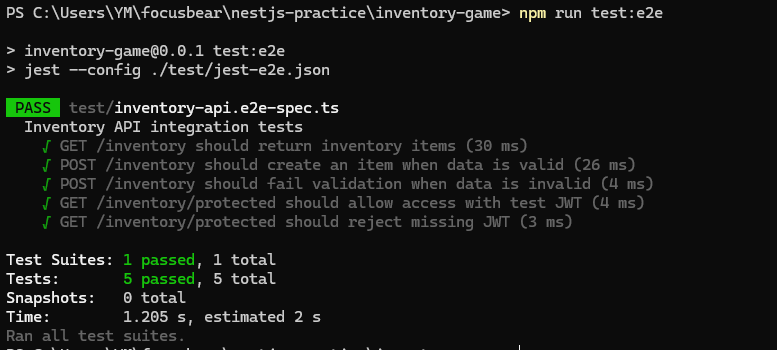

## Reflection

### How does Supertest help test API endpoints?

- Supertest helps by letting tests send real HTTP-style requests to the NestJS app. Instead of manually opening Postman or the browser, the test can call endpoints like GET /inventory or POST /inventory and check the response. In this task, Supertest was used to make sure the inventory endpoints returned the expected status codes and data

### What is the difference between unit tests and API tests?

- Unit tests check one small part of the app on its own, like a single service method. API tests check the app through its endpoints, which is closer to how a real user or frontend would use it. For example, the earlier unit test checked service logic directly, but this task tested routes like GET /inventory and POST /inventory using HTTP requests

### Why should authentication be mocked in integration tests?

- Authentication should be mocked so the test can focus on the API behaviour instead of needing a real login system or real JWT setup. If every test needed a real user login, it would be slower and more complicated. In this task, a test token was used to simulate an authenticated request, which made it easier to check that protected routes worked correctly

### How can you structure API tests to cover both success and failure cases?

- API tests should include both the “happy path” and the error cases. For example, testing POST /inventory with valid data checks that the request succeeds, while testing it with missing or invalid data checks that validation works properly. In this task, the tests covered successful GET and POST requests, invalid POST validation, authorised access, and rejected access without a token

## Task

- Installed the Supertest packages needed for API testing. Supertest lets the test send HTTP-style requests to the NestJS app, so endpoints can be tested in a way that is closer to how a real client would use the API

- Created an inventory DTO file for request validation. This DTO defines the expected shape of data for creating an inventory item, such as requiring a name and a valid quantity. This helps make sure invalid request data is rejected before it reaches the main logic 

- Updated the inventory controller to include GET and POST endpoints. The GET endpoint returns inventory items, while the POST endpoint accepts new item data and uses the DTO validation rules to check the request body 

- Added an API integration test using Supertest. The test sends requests to the inventory endpoints, checks successful responses, checks validation failure for invalid POST data, and also tests access to a protected route using a test token

- Ran the e2e test command using npm run test:e2e. The passing result confirms that the API endpoints, request validation, and mocked authentication flow are working correctly in the test environment

